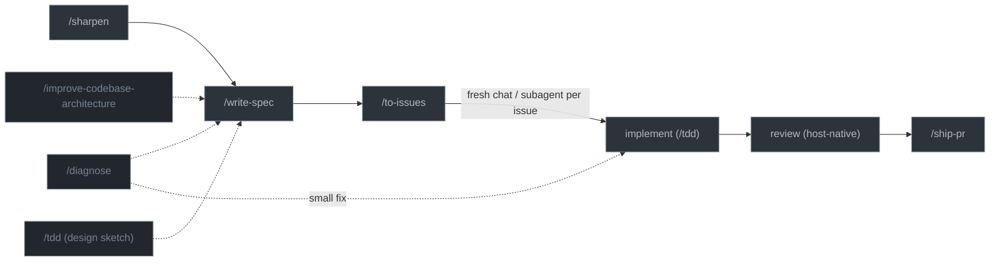

# agent-toolbox

A portable, spec-driven workflow and skill set for AI coding agents — works across Claude Code, Codex CLI, Antigravity CLI, and GitHub Copilot CLI with a single source of truth[^1].

## What's Here

```text
agent-toolbox/
├── .claude-plugin/
│   └── marketplace.json       # Claude marketplace; points at plugins/knack and plugins/lab
├── .agents/plugins/
│   └── marketplace.json       # Codex marketplace; points at plugins/knack and plugins/lab
├── plugins/knack/             # Core plugin: spec-driven workflows, skills, and agent definitions
│   ├── .claude-plugin/        #   Claude plugin manifest
│   ├── .codex-plugin/         #   Codex plugin manifest
│   ├── agents/                #   Agent definitions: Claude .md (via plugin), Codex .toml (via setup script)
│   └── skills/                #   Core skills for all providers
├── plugins/lab/               # Research plugin: autonomous experiments and data-viz guidance
│   ├── .claude-plugin/        #   Claude plugin manifest
│   ├── .codex-plugin/         #   Codex plugin manifest
│   └── skills/                #   Research skills (autoresearch, data-viz)
├── AGENTS.md                  # Shared provider-neutral instructions
└── scripts/setup-agent.sh     # Manual path for non-plugin providers and helper scripts
```

## Installation

### Claude Code (plugin)

Register this repo as a marketplace and install:

```bash
/plugin marketplace add kpeez/agent-toolbox
/plugin install knack@agent-toolbox
/plugin install lab@agent-toolbox
```

> `lab` is optional — install it on research machines where you use `autoresearch` and `data-viz`.

### Codex CLI (plugin)

Register this repo as a marketplace and install:

```bash
codex plugin marketplace add kpeez/agent-toolbox
codex plugin add knack@agent-toolbox
codex plugin add lab@agent-toolbox
```

> The Codex plugin delivers skills only. Codex plugins do not deliver agents, so
> the Codex `.toml` subagents are installed by the manual script below.

### Manual install (Codex agents, Antigravity, Copilot, and helper scripts)

Claude Code installs entirely from its plugin. Codex CLI installs skills from its
plugin but needs the manual script for its subagents. Use the manual script for
Codex agents and for providers that do not have a complete plugin install path
here. Skill scripts need no install — skills run them in place with `uv run`.

```bash
./scripts/setup-agent.sh
```

This installs to:

| Target          | Installed by manual script                             |
| --------------- | ------------------------------------------------------ |
| Codex agents    | `~/.codex/agents/*.toml`                               |
| Antigravity CLI | `~/.gemini/AGENTS.md` + skills symlinked from the repo |
| Copilot CLI     | `~/.copilot/copilot-instructions.md`                   |
| Claude statusline | `~/.claude/cc_statusline.py`                         |

Re-run after updating agent-toolbox.

### Versioning

Each plugin's version lives in exactly two files, kept identical: its
`.claude-plugin/plugin.json` and `.codex-plugin/plugin.json`. The marketplace
files (`.claude-plugin/marketplace.json`, `.agents/plugins/marketplace.json`)
carry no versions or metadata — they only point at the plugin directories.
Bump both manifests at once:

```bash
scripts/bump-plugin-version.sh knack 1.0.2
```

## Skills

| Skill                           | Purpose                                                                                                               |
| ------------------------------- | --------------------------------------------------------------------------------------------------------------------- |
| `setup-repo`                    | Interview-driven repo setup: thin repo-level `AGENTS.md`, `CLAUDE.md` symlink, and collision-safe llmOS-backed project docs topology |
| `start-loop`                    | Run/resume the whole spine as one command (sharpen → spec → issues → implement); spec approval is the last prompt, then the loop runs to done |
| `write-spec`                    | Create a feature spec — a pure-markdown design draft verified by committed tests; `/write-spec new` scaffolds it      |
| `implement`                     | How to implement a spec — prove behavior with `/tdd`, and orchestrate the work via delegation                         |
| `tdd`                           | Functional-test discipline — sketch scratch scripts in `tests/temp/` against the real repo, then refactor the survivors into committed tests proving the stated goals; no mock-slop |
| `sharpen`                       | Interview the user to stress-test a plan; cross-checks code, sharpens terms, records ADRs                             |
| `deliberate`                    | Resolve a two-way decision — two independent cases (for/against), one capped rebuttal, evidence-weighted synthesis   |
| `to-issues`                     | Break a spec/plan into independently-grabbable tracker issues using vertical slices                                 |
| `diagnose`                      | Disciplined debugging loop — build a feedback loop, reproduce, hypothesize, instrument, fix                           |
| `improve-codebase-architecture` | Find deepening opportunities — turn shallow modules into deep ones (deletion test, deep modules)                      |
| `zoom-out`                      | Go up a layer of abstraction and map an unfamiliar area of code                                                      |
| `ship-pr`                       | Publish branch work — group diff into atomic commits, push, open a draft PR (verifies lint/types/tests first); `finalize` mode flips the draft to ready |
| `delegate`                      | Delegate to cheaper workers — route reads to an explorer, plan/design drafting to a planner, writes to a doer, review what comes back; never write yourself |
| `handoff`                       | Hand the session across a model boundary — write the residue (ruled out, gotchas, resume) to the tracker; write it yourself, never via a subagent          |
| `merge-conflicts`               | Resolve merge/rebase conflicts — trace each side's intent, preserve both, verify with checks to catch semantic conflicts |
| `qmd`                           | Search local markdown knowledge bases (Obsidian vaults, notes, docs) with the `qmd` CLI                               |
| `research`                      | Investigate a question against primary sources via a background agent; capture cited findings as a Markdown file      |
| `validate-skills`               | Drift guard — check name/dir match, README inventory parity, manifest version parity, and dead skill references        |
| `autoresearch`                  | Autonomous experiment loops with defined metrics and private logs                                                     |
| `data-viz`                      | Research-backed guidance for designing and critiquing charts, plots, and figures                                      |

Each skill's frontmatter declares whether it is user-invocable.
Skills follow the [agentskills.io specification](https://agentskills.io/specification).

## Workflow

The spine is **sharpen → spec → issues → implement → review → pr**. For a new
feature, `/start-loop <idea>` runs that spine as one resumable command — it
restates the goal up front, recomputes state from artifacts so it can resume
mid-flight, and gives every task worker its own goal. It prompts the user
exactly twice, both during design (sharpen → spec, and spec approval); an
approved spec authorizes slicing, publishing, and the implementation loop to
run to completion with no further prompts. The intended shape: sharpen through
spec approval in one session, `/clear`, then bare `/start-loop` — it
reconstructs state from the spec and tracker, no explanation needed. Work
also enters at one of three points directly: `/sharpen` for a new feature whose
design isn't settled, `/diagnose` for a known bug, or
`/improve-codebase-architecture` when you're hunting for refactors. For
non-trivial work these converge on `/write-spec`; a small fix can skip straight to
implement.

Once the spec is settled, `/to-issues` publishes it (parent issue + sub-issues)
and **the tracker takes over** — each issue is then picked up independently, in a
fresh chat or a subagent, and runs its own implement → review → ship loop.
Implementation uses one discipline, `/tdd`: write the functional test directly
when the behavior is known, or sketch first — scratch scripts in gitignored
`tests/temp/` that verify the planned implementation against the real repo,
refactored into committed tests as the code stabilizes. `/tdd` also stands
alone as a design sketch before you commit to an approach. Durable decisions
get recorded as ADRs in `docs/agents/adrs/` along the way.



| Phase                                 | When / what happens                                                                                                                                                                                                                                          |
| ------------------------------------- | ------------------------------------------------------------------------------------------------------------------------------------------------------------------------------------------------------------------------------------------------------------ |
| `/sharpen`                           | **Entry: new feature, design unsettled.** Stress-test the plan against the code, sharpen terminology (into `CONTEXT.md`), record durable decisions as ADRs in `docs/agents/adrs/`.                                                                                  |
| `/diagnose`                           | **Entry: known bug.** Build a fast deterministic feedback loop, reproduce, rank hypotheses, instrument, fix, regression-test. Small fixes go straight to implement; complex ones feed a spec.                                                                |
| `/improve-codebase-architecture`      | **Entry: hunting refactors.** Find shallow modules and propose deepening refactors (deletion test, deep modules), informed by `CONTEXT.md` and `docs/agents/adrs/`.                                                                                                 |
| `/write-spec`                         | Capture the settled plan — pure-markdown `NNNN-<slug>.md` (human goal/scope header + agent design body); its Verification section names the committed tests that prove each behavior. In plan mode, dump the approved plan straight in. Establishes intent.         |
| `/to-issues`                          | Publish the spec as a parent issue + sub-issues (vertical slices); the tracker becomes the task and status ledger. Skip it only for a single-slice spec you implement in one sitting.                                                                        |
| **implement (`/tdd`)** | Per issue, in a fresh chat or subagent: one goal at a time (never horizontal batches). Scratch scripts in `tests/temp/` import the real repo to prove behavior, then are refactored into committed tests; the rest are deleted. No mock-slop. `/tdd` also stands alone as a design sketch. |
| review (host-native)                  | Clean-context review using your harness's built-in reviewer (e.g. Claude `/code-review`, Codex review). Challenge the approach, then flag bugs, bloat, and newly obsolete code before publishing.                                                            |
| `/ship-pr`                                 | Verify lint/types/tests, group the diff into atomic commits, push, open a draft PR if missing, link it to the tracker issue(s).                                                                                                                              |

Not every session hits every phase. The dashed skills are alternate entry points
or on-demand sketches. Run a host-native review pass before `/ship-pr`. To resume across
a session boundary, drop a progress comment on the active tracker issue and pick
it up from there.

### Roles and the fan-out loop

The main agent is the **orchestrator**: it coordinates, reviews, and holds the
human gates — it never burns its own context on bulk reads or typing
implementation. All heavy work is routed to workers by role, per `/delegate`:

| Role         | Does                                                              | Typical worker                             |
| ------------ | ----------------------------------------------------------------- | ------------------------------------------ |
| **explorer** | reads, exploration, summarizing across many files                 | haiku / `gpt-5.6-luna` (medium) / `gemini-3.5` |
| **planner**  | plan drafting, design review, spec critique — judgment over cost  | fable / opus (high) / `gpt-5.6-sol`        |
| **doer**     | implementing a well-specified chunk, reviewed via the diff        | sonnet / `gpt-5.6-luna` (xhigh)            |

Each `/start-loop` phase maps onto these roles: `sharpen` stays in the main
session (the interview is HITL) but can commission planners for alternatives;
spec *drafting* can go to a planner while the main session holds the approval
gate; `to-issues` goes to a **planner** that reviews the approved spec cold,
slices, publishes, and returns the issue list; review + `/ship-pr` run in a fresh
context.

Implementation is the **fan-out loop**:

> take the next unblocked issue → spawn a **doer** with the issue, a pointer to
> the spec, and its own `/goal` → review the diff → update the tracker → repeat
> until `COMPLETE`.

Independent issues fan out in parallel; issues that share files run
sequentially. Every handoff crosses a context boundary carrying only
identifiers and artifact pointers (spec path, slug, tracker ids) — never the
conversation. Blocked workers escalate to the orchestrator, which resolves what
the spec/ADRs answer, logs the decision as an issue comment, and relaunches —
the user is interrupted only for scope changes, spec contradictions, blocking
`ready-for-human` slices, or destructive actions. Planners return proposals for
the orchestrator to review with the user; workers never converse with the user
directly.

## Durable decision memory

Knowledge that must outlive a single feature, split by durability and where it
lives:

- **`docs/agents/adrs/`** — Architecture Decision Records. Durable, but like
  specs they are **not committed to the source repo**: they live in the shared
  llmOS vault at `$LLMOS_ROOT/projects/<repo>/docs/adrs`, reached through the
  gitignored `docs/agents/` symlink. Created lazily by `/sharpen`, `/tdd`, or
  `/improve-codebase-architecture` when a decision is hard to reverse, surprising
  without context, and the result of a real trade-off. They stop the agent from
  re-litigating settled choices. Unlike the transient `docs/agents/specs/` tree,
  ADRs persist across features.
- **`CONTEXT.md`** _(optional, repo root, committed)_ — a domain glossary,
  nothing else. Pins down overloaded terminology (especially useful for
  ML/research repos). Read by `sharpen`, `diagnose`, and
  `improve-codebase-architecture`.

The issue tracker is selected at runtime by `/to-issues` — an optional
`Issue tracker: <name>` line in the repo's `AGENTS.md` wins; otherwise Linear
when its MCP tools are available, GitHub when the repo has a GitHub remote and
`gh` works, local markdown named
`docs/agents/specs/NNNN-<slug>-issue-<NN>-<issue-slug>.md` as the fallback.
Conventions for each live in the `to-issues` skill's `references/`; there is no
per-repo config file.

## GitHub Workflow

Specs are work programs, not PR containers. A single spec can produce multiple
atomic PRs.

- Prefer atomic PRs that can be reviewed independently.
- Use small, logical commits with imperative, conventional-style subjects.
- Generate PR titles and bodies directly from `NNNN-<slug>.md`, the linked tracker
  issues, and the actual diff.
- Do not create `commits.md` or `draft-pr.md` review artifacts.
- Use squash merge by default unless the user explicitly asks for another merge
  method.
- After a PR merges, comment the PR number, merge or squash commit SHA, and a
  short note about what shipped on the relevant tracker issue, and move it to
  Done. Status lives on the tracker, not in a local file.

## Repo Setup

`/setup-repo` sets up a repo for the knack workflow: an injected facts block
reads the repo state (stack, lockfile, remote, existing files), the skill asks
which issue tracker to use and drafts a short Structure section, then writes
the thin repo-root `AGENTS.md` — stack commands (`uv run ruff format` /
`uv run ruff check` / `uv run ty check` for Python, the repo's real `typecheck`
script for JS/TS), changesets rules when `.changeset/` exists, and the Agent
skills block (`Issue tracker:` line, triage labels, domain docs layout) —
symlinks `CLAUDE.md → AGENTS.md`, and performs the agent docs setup below. The repo
file carries only repo conventions; the workflow spine and code rules live in
the user-level instructions, and tracker mechanics stay in `/to-issues`. The repo file carries only repo conventions — the workflow spine
and code rules already live in the user-level instructions.

## Agent Docs Setup

Agent-facing documentation is never committed to the source repository. It all
lives under one directory — **`docs/agents/`** — which is a gitignored symlink
to the project's docs tree in the shared llmOS vault:

```text
docs/agents -> $LLMOS_ROOT/projects/<project>/docs
├── specs/     # feature specs, and local-tracker issue files
├── adrs/      # architecture decision records
└── research/  # anything else agent-facing lives here too
```

The link is the whole contract: whatever the project's vault docs tree
contains shows up under `docs/agents/`, so new categories need no setup step.
`docs/agents` is the single ignore entry.

`/setup-repo` confirms the project mapping, then runs the reusable operation
from the installed setup-repo skill. It preflights all collisions before the
first mutation, migrates legacy project `specs` and `adr` trees plus repository
`docs/adr` content without overwrite or byte loss, retires the superseded
`docs/specs`, `docs/adrs`, `specs`, and `adrs` links, and repairs only symlinks:

```bash
: "${LLMOS_ROOT:?Set LLMOS_ROOT to the llmOS checkout}"
python3 "<setup-repo-skill-dir>/scripts/setup_project_docs.py" \
  --repo-root "$(git rev-parse --show-toplevel)" \
  --llmos-root "$LLMOS_ROOT" \
  --project "<confirmed-project>"
```

For linked worktrees, point `post-checkout` at that same resolved script. The
hook recreates missing or incorrect symlinks, never migrates real directories,
and tells the operator to run `/setup-repo` when migration is required:

```bash
#!/usr/bin/env bash
# post-checkout: $1=prev HEAD, $2=new HEAD, $3=1 if branch checkout

# only act on branch checkouts (not file restores)
[ "$3" = "1" ] || exit 0

# only act when we're inside a linked worktree, not the main repo
git_dir=$(git rev-parse --git-dir)
[[ "$git_dir" == *"/worktrees/"* ]] || exit 0

: "${LLMOS_ROOT:?Set LLMOS_ROOT to the llmOS checkout}"
python3 "<resolved-setup-repo-skill-dir>/scripts/setup_project_docs.py" \
  --repo-root "$(pwd)" \
  --llmos-root "$LLMOS_ROOT" \
  --project "<confirmed-project>" \
  --worktree
```

## Feature Specs

A spec is **`NNNN-<slug>.md`** — nothing more, and pure markdown (created by
`/write-spec new`). Verification lives in the repo's committed test suite; the
spec's Verification section names the tests that pin its behaviors.

```text
docs/agents/specs/
├── 0001-<slug>.md      # Human goal/scope header + agent-expanded design body
└── 0002-<slug>.md
```

Numbered flat, like `docs/agents/adrs/`. The number is the index — `ls` sorts it and
the highest is the newest, so specs carry no navigation or index file.

`NNNN-<slug>.md` has two ownership zones split by a `---` divider. The **goal/scope
header** is the user-reviewed contract: goal, scope, non-goals, success criteria,
validation, and whether implementation is review-gated or autonomous. The
**design body** is agent-expanded after repo inspection: approach, behavior,
decision log, risks, and verification mapping. Durable decisions (architecture,
provider policy, storage model, framework choice) go in the shared vault as ADRs
under `docs/agents/adrs/`, not the spec.

The spec is a **local, transient design draft** — it forces design thinking and
gives a review gate, then `/to-issues` hands the work to the tracker. There is no
local `STATUS.md`: the **issue tracker is the task and status ledger**, because
it's the one ledger every agent and your phone can read with no local convention.

- `/to-issues` publishes the spec's goal/scope as a **parent issue** plus
  **sub-issues** (the vertical slices) — the portable default on Linear and
  GitHub; escalate to a Linear **project** only for large, multi-milestone specs.
- Status is the issue state, blockers are the blocked-by links, and progress is
  the container rollup (e.g. 3/7 done) — reviewable remotely, maintained for free.
- **Resume across agents or context limits:** read the tracker container, grab the
  next unblocked issue, and before you run out of context drop a short progress
  comment on the active issue (done / next / the one gotcha). That comment is the
  handoff, living where the next agent already looks.

Rerun the tests named in the spec's Verification section to confirm behavior.
Don't keep a separate run log.

---

[^1]: Inspired by Matt Pocock's [skills repo](https://github.com/mattpocock/skills)
