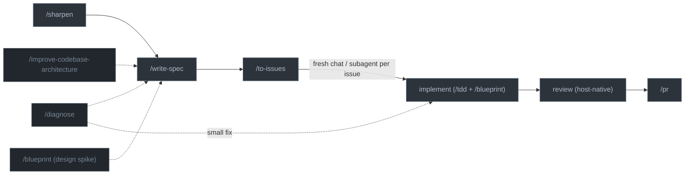

# agent-toolbox

A portable, spec-driven workflow and skill set for AI coding agents — works across Claude Code, Codex CLI, Antigravity CLI, and GitHub Copilot CLI with a single source of truth[^1].

## What's Here

```text
agent-toolbox/
├── .claude-plugin/
│   └── marketplace.json       # Claude marketplace; points at plugins/knack and plugins/lab
├── .agents/plugins/
│   └── marketplace.json       # Codex marketplace; points at plugins/knack and plugins/lab
├── plugins/knack/             # Core plugin: spec-driven workflows, skills, and agent definitions
│   ├── .claude-plugin/        #   Claude plugin manifest
│   ├── .codex-plugin/         #   Codex plugin manifest
│   ├── agents/                #   Agent definitions: Claude .md (via plugin), Codex .toml (via setup script)
│   └── skills/                #   Core skills for all providers
├── plugins/lab/               # Research plugin: autonomous experiments and data-viz guidance
│   ├── .claude-plugin/        #   Claude plugin manifest
│   ├── .codex-plugin/         #   Codex plugin manifest
│   └── skills/                #   Research skills (autoresearch, data-viz)
├── AGENTS.md                  # Shared provider-neutral instructions
└── scripts/setup-agent.sh     # Manual path for non-plugin providers and helper scripts
```

## Installation

### Claude Code (plugin)

Register this repo as a marketplace and install:

```bash
/plugin marketplace add kpeez/agent-toolbox
/plugin install knack@agent-toolbox
/plugin install lab@agent-toolbox
```

> `lab` is optional — install it on research machines where you use `autoresearch` and `data-viz`.

### Codex CLI (plugin)

Register this repo as a marketplace and install:

```bash
codex plugin marketplace add kpeez/agent-toolbox
codex plugin add knack@agent-toolbox
codex plugin add lab@agent-toolbox
```

> The Codex plugin delivers skills only. Codex plugins do not deliver agents, so
> the Codex `.toml` subagents are installed by the manual script below.

### Manual install (Codex agents, Antigravity, Copilot, and helper scripts)

Claude Code installs entirely from its plugin. Codex CLI installs skills from its
plugin but needs the manual script for its subagents. Use the manual script for
Codex agents and for providers that do not have a complete plugin install path
here. Skill scripts need no install — skills run them in place with `uv run`.

```bash
./scripts/setup-agent.sh
```

This installs to:

| Target          | Installed by manual script                             |
| --------------- | ------------------------------------------------------ |
| Codex agents    | `~/.codex/agents/*.toml`                               |
| Antigravity CLI | `~/.gemini/AGENTS.md` + skills symlinked from the repo |
| Copilot CLI     | `~/.copilot/copilot-instructions.md`                   |
| Claude statusline | `~/.claude/cc_statusline.py`                         |

Re-run after updating agent-toolbox.

### Versioning

Each plugin's version lives in exactly two files, kept identical: its
`.claude-plugin/plugin.json` and `.codex-plugin/plugin.json`. The marketplace
files (`.claude-plugin/marketplace.json`, `.agents/plugins/marketplace.json`)
carry no versions or metadata — they only point at the plugin directories.
Bump both manifests at once:

```bash
scripts/bump-plugin-version.sh knack 1.0.2
```

## Skills

| Skill                           | Plugin | Purpose                                                                                                               |
| ------------------------------- | ------ | --------------------------------------------------------------------------------------------------------------------- |
| `setup-repo`                    | knack  | Interview-driven repo setup: thin repo-level `AGENTS.md` (tracker, structure), `CLAUDE.md` symlink, specs directory   |
| `orchestrate`                   | knack  | Run/resume the whole spine as one gated command (sharpen → spec → issues → implement); restates the goal, resumes from artifacts (user-invoked) |
| `write-spec`                    | knack  | Create a feature spec — a local design draft plus runnable examples; `/write-spec new` scaffolds it                   |
| `implement`                     | knack  | How to implement a spec — prove behavior with `/tdd` + `/blueprint`, and orchestrate the work via delegation          |
| `tdd`                           | knack  | Test-driven development — one failing test → minimal code, vertical (not horizontal) slices, no mock-slop             |
| `blueprint`                     | knack  | Examples-based development — verify a planned implementation against the real repo, then promote the slice or discard |
| `sharpen`                       | knack  | Interview the user to stress-test a plan; cross-checks code, sharpens terms, records ADRs |
| `deliberate`                    | knack  | Resolve a two-way decision — two independent cases (for/against), one capped rebuttal, evidence-weighted synthesis (model/user-invoked) |
| `to-issues`                     | knack  | Break a spec/plan into independently-grabbable tracker issues using vertical slices                                   |
| `diagnose`                      | knack  | Disciplined debugging loop — build a feedback loop, reproduce, hypothesize, instrument, fix                           |
| `improve-codebase-architecture` | knack  | Find deepening opportunities — turn shallow modules into deep ones (deletion test, deep modules)                      |
| `zoom-out`                      | knack  | Go up a layer of abstraction and map an unfamiliar area of code (user-invoked)                                        |
| `pr`                            | knack  | Group branch diff into atomic commits, push, open a draft PR; verifies lint/types/tests/examples first               |
| `delegate`                      | knack  | Delegate to cheaper workers — route reads to a fast model, writes to a medium model, review what comes back; never write yourself (model-invoked) |
| `qmd`                           | knack  | Search local markdown knowledge bases (Obsidian vaults, notes, docs) with the `qmd` CLI                               |
| `documentation`                 | knack  | Write clear, reviewable Markdown specs, issues, PRs, ADRs, reports, guides, and handoffs                              |
| `validate-skills`               | knack  | Drift guard — check name/dir match, README inventory parity, manifest version parity, and dead skill references        |
| `autoresearch`                  | lab    | Autonomous experiment loops with defined metrics and private logs                                                     |
| `data-viz`                      | lab    | Research-backed guidance for designing and critiquing charts, plots, and figures                                      |

Skills follow the [agentskills.io specification](https://agentskills.io/specification).

## Workflow

The spine is **sharpen → spec → issues → implement → review → pr**. For a new
feature, `/orchestrate <idea>` runs that spine as one resumable command with a
human gate between phases — it restates the goal up front, recomputes state from
artifacts so it can resume mid-flight, and gives every worker its own goal. Work
also enters at one of three points directly: `/sharpen` for a new feature whose
design isn't settled, `/diagnose` for a known bug, or
`/improve-codebase-architecture` when you're hunting for refactors. For
non-trivial work these converge on `/write-spec`; a small fix can skip straight to
implement.

Once the spec is settled, `/to-issues` publishes it (parent issue + sub-issues)
and **the tracker takes over** — each issue is then picked up independently, in a
fresh chat or a subagent, and runs its own implement → review → ship loop.
Implementation uses two disciplines: `/tdd` (one failing test → minimal code) and
`/blueprint` (verify a planned implementation against the real repo, then promote
the slice). `/blueprint` also stands alone as a design spike before you commit to
an approach. Durable decisions get recorded as ADRs in `docs/adr/` along the way.



| Phase                                 | When / what happens                                                                                                                                                                                                                                          |
| ------------------------------------- | ------------------------------------------------------------------------------------------------------------------------------------------------------------------------------------------------------------------------------------------------------------ |
| `/sharpen`                           | **Entry: new feature, design unsettled.** Stress-test the plan against the code, sharpen terminology (into `CONTEXT.md`), record durable decisions as ADRs in `docs/adr/`.                                                                                   |
| `/diagnose`                           | **Entry: known bug.** Build a fast deterministic feedback loop, reproduce, rank hypotheses, instrument, fix, regression-test. Small fixes go straight to implement; complex ones feed a spec.                                                                |
| `/improve-codebase-architecture`      | **Entry: hunting refactors.** Find shallow modules and propose deepening refactors (deletion test, deep modules), informed by `CONTEXT.md` and `docs/adr/`.                                                                                                  |
| `/write-spec`                         | Capture the settled plan — `SPEC.md` (human goal/scope header + agent design body) plus runnable examples. In plan mode, dump the approved plan straight in. Establishes intent.                                                                             |
| `/to-issues`                          | Publish the spec as a parent issue + sub-issues (vertical slices); the tracker becomes the task and status ledger. Skip it only for a single-slice spec you implement in one sitting.                                                                        |
| **implement (`/tdd` + `/blueprint`)** | Per issue, in a fresh chat or subagent: vertical slices, one test → one implementation (never horizontal batches). Blueprint examples import the real repo to prove behavior, then graft in. No mock-slop. `/blueprint` also stands alone as a design spike. |
| review (host-native)                  | Clean-context review using your harness's built-in reviewer (e.g. Claude `/code-review`, Codex review). Challenge the approach, then flag bugs, bloat, and newly obsolete code before publishing.                                                            |
| `/pr`                                 | Verify lint/types/tests/examples, group the diff into atomic commits, push, open a draft PR if missing, link it to the tracker issue(s).                                                                                                                     |

Not every session hits every phase. The dashed skills are alternate entry points
or on-demand spikes. Run a host-native review pass before `/pr`. To resume across
a session boundary, drop a progress comment on the active tracker issue and pick
it up from there.

## Durable decision memory

Two committed files hold knowledge that must outlive a single feature and survive
a fresh clone — distinct from the private, ephemeral `specs/` tree:

- **`docs/adr/`** — Architecture Decision Records. Created lazily by `/sharpen`,
  `/blueprint`, or `/improve-codebase-architecture` when a decision is hard to
  reverse, surprising without context, and the result of a real trade-off. They
  stop the agent from re-litigating settled choices.
- **`CONTEXT.md`** _(optional, repo root)_ — a domain glossary, nothing else.
  Pins down overloaded terminology (especially useful for ML/research repos). Read
  by `sharpen`, `diagnose`, and `improve-codebase-architecture`.

The issue tracker is selected at runtime by `/to-issues` — an optional
`Issue tracker: <name>` line in the repo's `AGENTS.md` wins; otherwise Linear
when its MCP tools are available, GitHub when the repo has a GitHub remote and
`gh` works, local markdown under `specs/<feature>/issues/` as the fallback.
Conventions for each live in the `to-issues` skill's `references/`; there is no
per-repo config file.

## GitHub Workflow

Specs are work programs, not PR containers. A single spec can produce multiple
atomic PRs.

- Prefer atomic PRs that can be reviewed independently.
- Use small, logical commits with imperative, conventional-style subjects.
- Generate PR titles and bodies directly from `SPEC.md`, the linked tracker
  issues, and the actual diff.
- Do not create `commits.md` or `draft-pr.md` review artifacts.
- Use squash merge by default unless the user explicitly asks for another merge
  method.
- After a PR merges, comment the PR number, merge or squash commit SHA, and a
  short note about what shipped on the relevant tracker issue, and move it to
  Done. Status lives on the tracker, not in a local file.

## Repo Setup

`/setup-repo` sets up a repo for the knack workflow: an injected facts block
reads the repo state (stack, lockfile, remote, existing files), the skill asks
which issue tracker to use and drafts a short Structure section, then writes
the thin repo-root `AGENTS.md` — stack commands (`uv run ruff format` /
`uv run ruff check` / `uv run ty check` for Python, the repo's real `typecheck`
script for JS/TS), changesets rules when `.changeset/` exists, and the Agent
skills block (`Issue tracker:` line, triage labels, domain docs layout) —
symlinks `CLAUDE.md → AGENTS.md`, and performs the specs setup below. The repo
file carries only repo conventions; the workflow spine and code rules live in
the user-level instructions, and tracker mechanics stay in `/to-issues`. The repo file carries only repo conventions — the workflow spine
and code rules already live in the user-level instructions.

## Specs Setup

Specs are private working context and should never be committed. Store the real
files outside the repo (for example `~/Documents/specs/<repo>/`, cloud-synced
and per-repo), add `specs` to `.gitignore`, and symlink `./specs` back in:

```bash
mkdir -p ~/Documents/specs/<repo>
ln -s ~/Documents/specs/<repo> ./specs
echo specs >> .gitignore
```

If you use a worktree-based setup, you should set up the following post-checkout git hook to automatically symlink the specs directory:

```bash
#!/usr/bin/env bash
# post-checkout: $1=prev HEAD, $2=new HEAD, $3=1 if branch checkout

# only act on branch checkouts (not file restores)
[ "$3" = "1" ] || exit 0

# only act when we're inside a linked worktree, not the main repo
git_dir=$(git rev-parse --git-dir)
[[ "$git_dir" == *"/worktrees/"* ]] || exit 0

ln -sfn ~/Documents/specs/<repo> "$(pwd)/specs"
```

## Feature Specs

A spec is **`SPEC.md` plus `examples/`** — nothing more (created by `/write-spec new`):

```text
specs/
├── AGENTS.md           # How agents navigate specs; not a manual index
└── <feature>/
    ├── SPEC.md         # Human goal/scope header + agent-expanded design body
    └── examples/       # Runnable verification scripts (REQUIRED)
```

`SPEC.md` has two ownership zones split by a `---` divider. The **goal/scope
header** is the user-reviewed contract: goal, scope, non-goals, success criteria,
validation, and whether implementation is review-gated or autonomous. The
**design body** is agent-expanded after repo inspection: approach, behavior,
decision log, risks, and verification mapping. Durable decisions (architecture,
provider policy, storage model, framework choice) go in committed `docs/adr/`,
not the spec.

The spec is a **local, transient design draft** — it forces design thinking and
gives a review gate, then `/to-issues` hands the work to the tracker. There is no
local `STATUS.md`: the **issue tracker is the task and status ledger**, because
it's the one ledger every agent and your phone can read with no local convention.

- `/to-issues` publishes the spec's goal/scope as a **parent issue** plus
  **sub-issues** (the vertical slices) — the portable default on Linear and
  GitHub; escalate to a Linear **project** only for large, multi-milestone specs.
- Status is the issue state, blockers are the blocked-by links, and progress is
  the container rollup (e.g. 3/7 done) — reviewable remotely, maintained for free.
- **Resume across agents or context limits:** read the tracker container, grab the
  next unblocked issue, and before you run out of context drop a short progress
  comment on the active issue (done / next / the one gotcha). That comment is the
  handoff, living where the next agent already looks.

The examples are the verification record — rerun them to confirm behavior. Don't
keep a separate run log.

---

[^1]: Inspired by Matt Pocock's [skills repo](https://github.com/mattpocock/skills)
