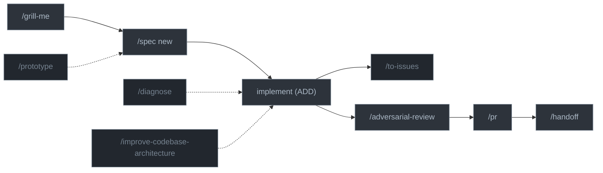

# agent-toolbox

A portable, spec-driven workflow and skill set for AI coding agents — works across Claude Code, Codex CLI, Antigravity CLI, and GitHub Copilot CLI with a single source of truth[^1].

## What's Here

```text
agent-toolbox/
├── .claude-plugin/
│   └── marketplace.json       # Claude marketplace; points at plugins/knack and plugins/lab
├── .agents/plugins/
│   └── marketplace.json       # Codex marketplace; points at plugins/knack and plugins/lab
├── plugins/knack/             # Core plugin: spec-driven workflows, skills, and agent definitions
│   ├── .claude-plugin/        #   Claude plugin manifest
│   ├── .codex-plugin/         #   Codex plugin manifest
│   ├── agents/                #   Agent definitions: Claude .md (via plugin), Codex .toml (via setup script)
│   └── skills/                #   Core skills for all providers
├── plugins/lab/               # Research plugin: autonomous experiments and data-viz guidance
│   ├── .claude-plugin/        #   Claude plugin manifest
│   ├── .codex-plugin/         #   Codex plugin manifest
│   └── skills/                #   Research skills (autoresearch, data-viz)
├── AGENTS.md                  # Shared provider-neutral instructions
└── scripts/setup-agent.sh     # Manual path for non-plugin providers and helper scripts
```

## Installation

### Claude Code (plugin)

Register this repo as a marketplace and install:

```bash
/plugin marketplace add kpeez/agent-toolbox
/plugin install knack@agent-toolbox
/plugin install lab@agent-toolbox
```

> `lab` is optional — install it on research machines where you use `autoresearch` and `data-viz`.

### Codex CLI (plugin)

Register this repo as a marketplace and install:

```bash
codex plugin marketplace add kpeez/agent-toolbox
codex plugin add knack@agent-toolbox
codex plugin add lab@agent-toolbox
```

> The Codex plugin delivers skills only. Codex plugins do not deliver agents, so
> the Codex `.toml` subagents are installed by the manual script below.

### Manual install (Codex agents, Antigravity, Copilot, and helper scripts)

Claude Code installs entirely from its plugin. Codex CLI installs skills from its
plugin but needs the manual script for its subagents. Use the manual script for
Codex agents, for providers that do not have a complete plugin install path here,
and for the shared helper commands used by skills.

```bash
./scripts/setup-agent.sh
```

Skills are written to `~/.agents/skills`. The script overwrites the
agent-toolbox-owned Antigravity and Copilot instruction files and refreshes helper
command symlinks.

This installs to:

| Target          | Installed by manual script                       |
|-----------------|--------------------------------------------------|
| Shared skills   | `~/.agents/skills`                               |
| Helper commands | `~/.agents/bin/local-explore` and `ext-subagent` |
| Codex agents    | `~/.codex/agents/*.toml`                         |
| Antigravity CLI | `~/.gemini/AGENTS.md` + skills symlink           |
| Copilot CLI     | `~/.copilot/copilot-instructions.md`             |

Re-run after updating agent-toolbox.

## Skills

| Skill                 | Plugin | Purpose                                                                                               |
|-----------------------|--------|-------------------------------------------------------------------------------------------------------|
| `agentic-development`            | knack  | Agent-Driven Development discipline — examples before implementation, red/green, test-quality rules   |
| `spec`                           | knack  | Create and manage feature specs; `/spec new` scaffolds a feature, `/spec status` regenerates overview |
| `grill-me`                       | knack  | Interview the user to stress-test a plan; cross-checks code, sharpens terms, records ADRs             |
| `prototype`                      | knack  | Build throwaway code to answer a design question, capture the verdict, then delete it                 |
| `to-issues`                      | knack  | Break a spec/plan into independently-grabbable tracker issues using vertical slices                   |
| `diagnose`                       | knack  | Disciplined debugging loop — build a feedback loop, reproduce, hypothesize, instrument, fix           |
| `improve-codebase-architecture`  | knack  | Find deepening opportunities — turn shallow modules into deep ones (deletion test, deep modules)      |
| `zoom-out`                       | knack  | Go up a layer of abstraction and map an unfamiliar area of code (user-invoked)                        |
| `adversarial-review`             | knack  | Clean-context hostile review of the branch diff — challenge approach/design, flag bloat (review-only) |
| `pr`                             | knack  | Group branch diff into atomic commits, push, open a draft PR, write the spec markdown artifact        |
| `ship`                           | knack  | Chain `/adversarial-review` then `/pr` in one pass                                                    |
| `handoff`                        | knack  | Capture session context before ending for a clean resume                                              |
| `delegating-work`                | knack  | Offload exploration and code generation to local or external worker CLIs                              |
| `using-linear`                   | knack  | Linear issue tracking integration — status gates, comments, and source-of-truth rules                 |
| `qmd`                            | knack  | Search local markdown knowledge bases (Obsidian vaults, notes, docs) with the `qmd` CLI               |
| `autoresearch`                   | lab    | Autonomous experiment loops with defined metrics and private logs                                     |
| `data-viz`                       | lab    | Research-backed guidance for designing and critiquing charts, plots, and figures                      |

Skills follow the [agentskills.io specification](https://agentskills.io/specification).

## Workflow

The spine is **grill → spec → implement (ADD) → review → ship**. Three on-demand
skills branch off it: `/prototype` resolves a design question with throwaway code
before you commit to it, `/diagnose` is the debugging loop when something breaks,
and `/improve-codebase-architecture` finds refactors when friction builds up.
Durable decisions get recorded as ADRs in `docs/adr/` along the way.



| Phase                            | What happens                                                                                                                                                                             |
|----------------------------------|----------------------------------------------------------------------------------------------------------------------------------------------------------------------------------------- |
| `/grill-me`                      | Stress-test the plan. Cross-checks claims against code, sharpens terminology (into `CONTEXT.md`), and records durable decisions as ADRs in `docs/adr/`.                                  |
| `/prototype` *(optional)*        | Throwaway code to answer a design question. Capture the verdict (ADR or spec note), then delete it. For long autonomous explorations use `lab:autoresearch` instead.                     |
| `/spec new`                      | Create the feature spec — `SPEC.md` (human goal/scope header + agent design body), `STATUS.md`, and runnable examples. Establishes intent.                                              |
| **implement (ADD)**              | Examples first → red → implement → green. Tests verify behavior through public interfaces — no mock-slop. Update `STATUS.md` (done/next/run log) as you go.                              |
| `/to-issues` *(optional)*        | Break the spec into independently-grabbable tracker issues (vertical slices). Default tracker is Linear via `issue-tracker.md`.                                                          |
| `/diagnose` *(on bugs)*          | Build a fast deterministic feedback loop, reproduce, rank hypotheses, instrument, fix, regression-test.                                                                                  |
| `/improve-codebase-architecture` | When friction builds up: find shallow modules and propose deepening refactors (deletion test, deep modules), informed by `CONTEXT.md` and `docs/adr/`.                                  |
| `/adversarial-review`            | Clean-context hostile pass in a fresh reviewer. Challenges the approach/design, then flags bloat, smells, and newly obsolete code. Review-only — returns findings; `/ship` applies them. |
| `/pr`                            | Group the diff into atomic commits, push, open a draft PR if missing, write the spec markdown artifact.                                                                                  |
| `/handoff`                       | Capture session state — what's done, what's next, critical context — into the `STATUS.md` `## Handoffs` section.                                                                        |

Not every session hits every phase. The dashed skills are pulled in only when
needed. `/adversarial-review` is most useful before `/pr`; use `/ship` to run it
and `/pr` back-to-back. `/handoff` is for any session boundary.

## Durable decision memory

Two committed files hold knowledge that must outlive a single feature and survive
a fresh clone — distinct from the private, ephemeral `specs/` tree:

- **`docs/adr/`** — Architecture Decision Records. Created lazily by `/grill-me`,
  `/prototype`, or `/improve-codebase-architecture` when a decision is hard to
  reverse, surprising without context, and the result of a real trade-off. They
  stop the agent from re-litigating settled choices.
- **`CONTEXT.md`** *(optional, repo root)* — a domain glossary, nothing else.
  Pins down overloaded terminology (especially useful for ML/research repos). Read
  by `grill-me`, `diagnose`, and `improve-codebase-architecture`.

The issue tracker is pluggable via a repo-root **`issue-tracker.md`** (default
Linear). `/to-issues` and `/using-linear` read it.

## GitHub Workflow

Specs are work programs, not PR containers. A single spec can produce multiple
atomic PRs.

- Prefer atomic PRs that can be reviewed independently.
- Use small, logical commits with imperative, conventional-style subjects.
- Generate PR titles and bodies directly from `SPEC.md`,
  `STATUS.md`, linked issues, and the actual diff.
- Do not create `commits.md` or `draft-pr.md` review artifacts.
- Use squash merge by default unless the user explicitly asks for another merge
  method.
- After a PR merges, update the relevant `STATUS.md` with PR number, merge or
  squash commit SHA, and a short note about what shipped.
- `specs/STATUS.md` is regenerated automatically by the knack plugin hook after
  any write to a file under `specs/`. Local git hooks (post-commit, post-merge)
  serve as a safety net for commits made outside an agent session.

## Specs Setup

Specs are private working context and should never be committed. Store the real
files outside the repo (for example `~/Documents/specs/<repo>/`, cloud-synced
and per-repo), add `specs` to `.gitignore`, and symlink `./specs` back in:

```bash
mkdir -p ~/Documents/specs/<repo>
ln -s ~/Documents/specs/<repo> ./specs
echo specs >> .gitignore
```

If you use a worktree-based setup, you should set up the following post-checkout git hook to automatically symlink the specs directory:

```bash
#!/usr/bin/env bash
# post-checkout: $1=prev HEAD, $2=new HEAD, $3=1 if branch checkout

# only act on branch checkouts (not file restores)
[ "$3" = "1" ] || exit 0

# only act when we're inside a linked worktree, not the main repo
git_dir=$(git rev-parse --git-dir)
[[ "$git_dir" == *"/worktrees/"* ]] || exit 0

ln -sfn ~/Documents/specs/<repo> "$(pwd)/specs"
```

## Feature Specs

A spec is **two files plus `examples/`** — nothing more (created by `/spec new`):

```text
specs/
├── AGENTS.md           # How agents navigate specs; not a manual index
└── <feature>/
    ├── SPEC.md         # Human goal/scope header + agent-expanded design body
    ├── STATUS.md       # Status, tasks, run log, handoffs, merged work
    └── examples/       # Runnable verification scripts (REQUIRED)
```

`SPEC.md` has two ownership zones split by a `---` divider. The **goal/scope
header** is the user-reviewed contract: goal, scope, non-goals, success criteria,
validation, and whether implementation is review-gated or autonomous. The
**design body** is agent-expanded after repo inspection: approach, behavior,
decision log, risks, and verification mapping. Durable decisions (architecture,
provider policy, storage model, framework choice) go in committed `docs/adr/`,
not the spec.

`STATUS.md` is the entry point and the durable task ledger. Its `## Next` list is
the task list — Claude Code's native todo list is ephemeral and cannot be
redirected to a file, so don't create a parallel `tasks.json`; sync the final
todo state into `## Next`. The run log and session handoffs fold into `STATUS.md`
too (`## Run Log`, `## Handoffs`) rather than separate files.

Do not maintain a manual `specs/INDEX`. Each spec is self-describing through
`STATUS.md`; derive overviews by scanning `specs/*/STATUS.md` when needed.
The project-level `specs/STATUS.md` file is generated by `spec_status.py`; do
not edit it by hand.

The core of context continuity is `STATUS.md`:

```markdown
---
summary: <one or two sentence description for the project overview>
---

# <Title> - Status

## Status

- **Phase**: plan | spec | examples | implementing | verifying | done
- **Blocked**: no | yes (reason)

## Done

- [x] completed item

## Next

- [ ] next item

## Context

<gotchas, key files>

## Merged Work

- PR #12: Add example feature
  - Commit: `abc123`
  - Shipped: implemented the first atomic slice

## Run Log

### basic_pipeline_run.py
**Status:** PASS · **Date:** 2026-06-08
**Verifies:** happy-path execution · **Result:** exit 0, output matched

## Handoffs

### Session: 2026-06-08
- **Completed:** <what was done>
- **Critical context:** <what the next session must know>
- **Resume:** <command to pick up>
```

---

[^1]: Inspired by this Tweet by Ashpreet Bedi: <https://x.com/ashpreetbedi/status/2011220028453241218>
