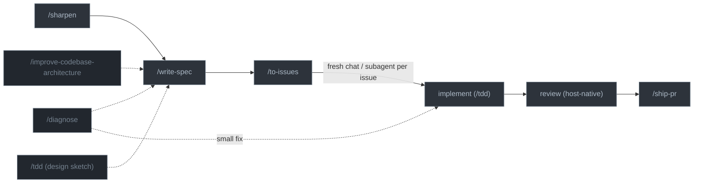

# agent-toolbox

A portable, spec-driven workflow and skill set for AI coding agents — one
source of truth across Claude Code, Codex CLI, Antigravity CLI, and GitHub
Copilot CLI[^1].

Three plugins:

- **swe** — the core: the spec-driven workflow skills and the six-agent swe-loop
- **lab** — research: autonomous experiment loops and data-viz guidance
- **llmos** — tooling for the shared llmOS Obsidian vault

```text
agent-toolbox/
├── .claude-plugin/marketplace.json    # Claude marketplace catalog
├── .agents/plugins/marketplace.json   # Codex marketplace catalog
├── plugins/
│   ├── swe/                           # Workflow skills + agent definitions (.md + .toml twins)
│   ├── lab/                           # Research skills
│   └── llmos/                        # Vault skills, hooks, and the llmos_vault library
├── AGENTS.md                          # Shared provider-neutral instructions
└── scripts/install.sh                 # Manual path for non-plugin providers
```

## Installation

### Claude Code

```bash
/plugin marketplace add kpeez/agent-toolbox
/plugin install swe@agent-toolbox
/plugin install lab@agent-toolbox      # optional: research machines
/plugin install llmos@agent-toolbox    # optional: machines with the llmOS vault
```

### Codex CLI

```bash
codex plugin marketplace add kpeez/agent-toolbox
codex plugin add swe@agent-toolbox
codex plugin add lab@agent-toolbox
```

> Codex plugins deliver skills only; the Codex `.toml` subagents come from the
> manual script below.

### Manual install (Codex agents, Antigravity, Copilot)

```bash
./scripts/install.sh
```

| Target            | Installed to                                           |
| ----------------- | ------------------------------------------------------ |
| Codex agents      | `~/.codex/agents/*.toml`                               |
| Antigravity CLI   | `~/.gemini/AGENTS.md` + skills symlinked from the repo |
| Copilot CLI       | `~/.copilot/copilot-instructions.md`                   |
| Claude statusline | `~/.claude/cc_statusline.py`                           |

Re-run after updating agent-toolbox. Skill scripts need no install — skills run
them in place with `uv run`.

## Skills

Each skill's `SKILL.md` is the canonical contract; this table is just the map.
Skills follow the [agentskills.io specification](https://agentskills.io/specification).

### swe

| Skill                           | Purpose                                                                                   |
| ------------------------------- | ----------------------------------------------------------------------------------------- |
| `start-loop`                    | Run/resume the swe-loop end to end — triage, design, approval gate, then the conductor ships the spec |
| `sharpen`                       | Interview the user to stress-test a plan; cross-check the code, record ADRs               |
| `write-spec`                    | Create a feature spec — a pure-markdown design draft proven by committed tests            |
| `to-issues`                     | Publish a spec as vertical-slice tracker issues with blocked-by relations                 |
| `implement`                     | Orchestrate implementing a spec — prove behavior with `/tdd`, fan work out to agents      |
| `tdd`                           | Functional-test discipline — scratch scripts in `tests/temp/`, survivors become committed tests |
| `ship-pr`                       | Group the branch diff into atomic commits, push, open a draft PR; `finalize` flips it ready |
| `diagnose`                      | Disciplined debugging — build a feedback loop, reproduce, hypothesize, instrument, fix    |
| `improve-codebase-architecture` | Find deepening refactors — turn shallow modules into deep ones                            |
| `merge-conflicts`               | Resolve conflicts by tracing each side's intent; verify with the project's checks         |
| `research`                      | Investigate a question against primary sources; capture cited findings as markdown        |
| `qmd`                           | Search local markdown knowledge bases with the `qmd` CLI                                  |
| `setup-repo`                    | Interview-driven repo setup — thin `AGENTS.md`, `CLAUDE.md` symlink, `docs/agents/` topology |

### lab

| Skill          | Purpose                                                                  |
| -------------- | ------------------------------------------------------------------------ |
| `autoresearch` | Autonomous experiment loops with defined metrics and stop conditions     |
| `data-viz`     | Research-backed guidance for designing and critiquing charts and figures |

### llmos

| Skill           | Purpose                                                          |
| --------------- | ---------------------------------------------------------------- |
| `maintain-llmos` | Maintain the shared llmOS Obsidian vault through its conventions |
| `setup-llmos`   | Diagnose and configure machine access to the llmOS vault         |
| `vault-cli`     | Route deterministic vault operations through the llmos-vault CLI |

## Agents

Six capability roles in `plugins/swe/agents/`, each a Claude `.md` with a Codex
`.toml` twin (keep them in sync). They are the swe-loop's workers: the
deterministic `swe-loop.js` conductor decides what runs when, each agent does
its one phase, and results flow back as structured data — identifiers in,
typed status out, never user-facing prose.

| Agent         | Purpose                                                                                    |
| ------------- | ------------------------------------------------------------------------------------------ |
| `explorer`    | Cheap read-only evidence gathering with cited paths                                        |
| `architect`   | Read-only design resolution and spec drafting; returns drafts for the orchestrator to apply |
| `planner`     | Publishes an approved spec as vertical tracker slices with native blocked-by relations     |
| `implementer` | Executes one bounded code, test, documentation, or tracker task under caller constraints   |
| `reviewer`    | Read-only review of a diff or implementation against caller-provided criteria or one lens  |
| `publisher`   | Owns git and GitHub publication: atomic commits, push, PR creation                         |

## Workflow

The spine is **sharpen → spec → issues → implement → review → PR**.
`/start-loop <idea>` runs it as one resumable command: triage decides whether
design is interactive or autonomous, and an approved spec authorizes the
conductor to slice, implement, review, and ship with no further prompts. Work
can also enter directly — `/sharpen` for an unsettled design, `/diagnose` for
a known bug, `/improve-codebase-architecture` when hunting refactors — and
converges on `/write-spec`, after which `/to-issues` makes the tracker the
task and status ledger. Implementation proves behavior per `/tdd`; a
host-native review pass (e.g. `/code-review`) runs before `/ship-pr`.


```mermaid
graph LR
  G["/sharpen"] --> A["/write-spec"]
  X["/diagnose"] -.-> A
  Y["/improve-codebase-architecture"] -.-> A
  A --> I["/to-issues"]
  I -->|"fresh chat / subagent per issue"| B["implement (/tdd)"]
  B --> C["review (host-native)"]
  C --> D["/ship-pr"]
  X -.->|"small fix"| B
  P["/tdd (design sketch)"] -.-> A

style G fill:#2d333b,stroke:#768390,color:#adbac7
style A fill:#2d333b,stroke:#768390,color:#adbac7
style I fill:#2d333b,stroke:#768390,color:#adbac7
style B fill:#2d333b,stroke:#768390,color:#adbac7
style C fill:#2d333b,stroke:#768390,color:#adbac7
style D fill:#2d333b,stroke:#768390,color:#adbac7
style X fill:#22272e,stroke:#768390,color:#768390
style Y fill:#22272e,stroke:#768390,color:#768390
style P fill:#22272e,stroke:#768390,color:#768390
```

Agent-facing docs (specs, ADRs, research) are never committed to the source
repo — they live under the gitignored `docs/agents/` symlink into the llmOS
vault, created by `/setup-repo`.

## Versioning

Each plugin's version lives in exactly two files, kept identical: its
`.claude-plugin/plugin.json` and `.codex-plugin/plugin.json`. The marketplace
catalogs carry only names and paths — regenerate them with
`scripts/gen-marketplaces.py`, never hand-edit. Bump both manifests at once:

```bash
scripts/bump-plugin-version.sh swe 1.9.4
```

A bump is inert until it lands on master — both providers install from GitHub,
not the working copy.

[^1]: Inspired by Matt Pocock's [skills repo](https://github.com/mattpocock/skills)
