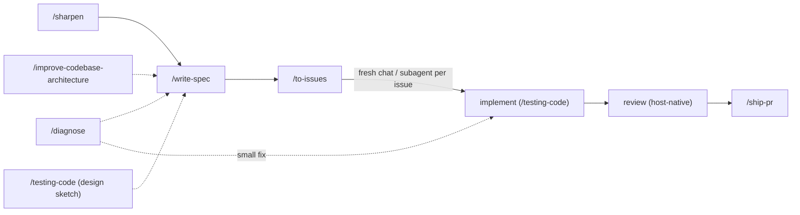

# swe plugin

The core of agent-toolbox: a spec-driven software-engineering workflow packaged
as skills, capability agents, and a formatting hook. The premise is that agents ship reliable work when the
process is explicit — designs get stress-tested before they become specs,
observable claims name independent oracles and proportionate evidence, status
lives on the issue tracker, and publication is atomic commits behind a draft PR.

## Contents

```text
plugins/swe/
├── skills/            # 14 workflow skills (SKILL.md each — the canonical contracts)
├── agents/            # 9 agent definitions: Claude .md + Codex .toml twins (the forwarders: .md only)
├── .mcp.json          # the OpenCode server exposed natively to Codex
├── .mcp.claude.json   # Claude's OpenCode server
├── mcp/
│   └── acp_bridge.py  # Agent Client Protocol agent -> MCP, with the permission policy
├── scripts/
│   ├── linear_tracker.py      # Linear via the `linear` CLI: workable set, container link, status sync
│   └── validate_artifacts.py  # shape checks for specs and issues before publish
└── hooks/
    ├── hooks.json                       # event wiring for the Claude-session hooks
    ├── symlink-worktree-shared-dirs.sh  # link gitignored local dirs into worktrees
    ├── git-hooks-dispatch.sh            # global git hook: same linking for non-Claude worktrees
    └── format-python.sh                 # format + lint .py files after Write/Edit
```

## The workflow spine

Every path through the plugin converges on the same spine:
**sharpen → spec → issues → implement → review → PR.**

Work can enter anywhere — `/sharpen` for an unsettled design, `/diagnose` for
a known bug, `/improve-codebase-architecture` when hunting refactors — and
converges on `/write-spec`. From there `/to-issues` makes the tracker the task
and status ledger, implementation proves behavior per `/testing-code`, a host-native
review pass (e.g. `/code-review`) runs before `/ship-pr` publishes.



Two ways to run the spine:

- **Skill by skill** — invoke each skill yourself. Useful for work that is
  already mid-flight or does not need the full loop.
- **As one resumable command** — `/start-loop <idea>` runs the approved-spec
  half to completion itself: dispatch, gates, merges, review, and ship, with
  no live prompts.

## The swe-loop

Sharpening and spec-writing happen in a prior session, never inside the run
itself. `/start-loop` requires the spec's frontmatter to already carry
`approved: true` — a spec without it is a stop, pointing at `/sharpen` or
`/write-spec` instead of proceeding. Once the approved spec authorizes the
run, problems reach the user as data (escalation reports), never as live
prompts.

There is no conductor process and no Workflow tool: the lead session runs the
loop directly. It dispatches one implementer subagent per unblocked task —
parallel when tasks are independent — reads back each `{status, branch,
summary}` report, and runs the verification gates and the merge itself with
shell commands, never a model call. When the frontier drains it dispatches a
single reviewer against the assembled diff, cycles at most two fix rounds,
then ships one PR with `gh pr create`. The lead never reads implementation
code itself — reports, gate output, and merge results are its whole context
diet.

Tasks run concurrently: implementers work in isolated git worktrees and the
lead serializes merges into the integration branch, so parallel tasks never
race on the working copy.

### Handoffs and escalation

Every agent boundary carries only identifiers and artifact pointers — spec
path, slug, container id, branch — never conversation state. State a resumed
run reads is machine-readable and never a markdown comment: approval, execution
mode, run id, integration branch and tracker container live in the spec's YAML
frontmatter; issue status lives on the tracker; what is already merged lives in
git. Comments carry only what humans read — triage rationale, progress notes,
escalations.

### Model policy

The lead session (Opus suffices) reads reports and runs git; it never runs an
implementer's or reviewer's model itself. Implementers and the fixer default
to OpenCode (`gpt-5.6-luna`) when the Go subscription is flat-rate, else
Sonnet at high effort, escalating to Opus after two failed gate rounds on the
same task. The reviewer always runs on a different model family from the
implementer — deepseek-v4-pro, or Sonnet/Opus — one invocation, on the
assembled diff. A routed provider that is missing, unauthenticated, or fails
ACP startup surfaces as a delegation failure and then an escalation; nothing
ever falls back to another provider on its own.

## Skills

Each `SKILL.md` is the canonical contract; summaries here are orientation.

**Design and specification**

| Skill        | What it does                                                                                                                                              |
| ------------ | --------------------------------------------------------------------------------------------------------------------------------------------------------- |
| `sharpen`    | Interviews the user until every branch of a design's decision tree is resolved; cross-checks claims against the code; records durable decisions as ADRs   |
| `write-spec` | Produces the feature spec — a pure-markdown `NNNN-<slug>.md` whose observable claims name independent oracles and acceptable evidence; carries approval |
| `codebase-design` | Shared vocabulary for deep modules — depth, seams, adapters, the deletion test; loaded by other skills when designing interfaces                      |
| `improve-codebase-architecture` | Hunts deepening refactors: shallow modules that should absorb their callers' complexity                                                     |

**Execution**

| Skill        | What it does                                                                                                                       |
| ------------ | ---------------------------------------------------------------------------------------------------------------------------------- |
| `start-loop` | Runs an approved spec to a shipped PR: the lead dispatches implementers and a reviewer, and runs gates and merges itself            |
| `to-issues`  | Publishes a spec as vertical-task tracker issues with native blocked-by relations; the tracker becomes the status ledger           |
| `implement`  | Orchestrates implementation for a single task or changeset outside a `/start-loop` run                                              |
| `testing-code`        | Behavioral testing: use disposable real-code probes, then retain only stable, risk-proportionate evidence at public seams            |
| `ship-pr`    | Atomic commits, push, draft PR kept current; `finalize` re-verifies and flips it ready for review                                   |

**Support**

| Skill             | What it does                                                                                    |
| ----------------- | ----------------------------------------------------------------------------------------------- |
| `diagnose`        | Disciplined debugging: feedback loop, reproduce, hypothesize, instrument, fix, regression-test  |
| `merge-conflicts` | Resolves merge/rebase conflicts by tracing each side's intent; verifies with the project checks |
| `qmd`             | Searches local markdown knowledge bases with the `qmd` CLI                                      |
| `setup-repo`      | Interview-driven repo setup: thin `AGENTS.md`, `CLAUDE.md` symlink, `docs/agents/` topology     |

## Agents

Nine definitions in `agents/`: each a Claude `.md`, six with a Codex `.toml`
twin kept in sync (the model matrix below is pinned by `tests/test_skill_drift.py`).
`/start-loop` dispatches `implementer` and `reviewer` directly; `explorer` and
`architect` are dispatched by other skills (`/sharpen`, `/write-spec`,
`/implement`, `/to-issues`). `planner` and `publisher` are standalone
agents — callerless by the workflow skills — available for direct dispatch
when you want their bounded behavior outside a skill.

| Agent             | Purpose                                                                                  | Claude model (effort) | Codex model (effort)   |
| ----------------- | ---------------------------------------------------------------------------------------- | --------------------- | ---------------------- |
| `explorer`        | Cheap read-only evidence gathering with cited paths                                      | haiku                 | gpt-5.6-luna (medium)  |
| `architect`       | Read-only design resolution and spec drafting; returns drafts for the caller to apply    | fable (high)          | gpt-5.6-sol (high)     |
| `planner`         | Publishes an approved spec as vertical tracker tasks with blocked-by relations          | sonnet (medium)       | gpt-5.6-terra (medium) |
| `implementer`     | Executes one bounded code, test, documentation, or tracker task under caller constraints | sonnet (medium)         | gpt-5.6-sol (medium)   |
| `reviewer`        | Read-only review of a diff or implementation against caller-provided criteria or a lens  | sonnet (high)         | gpt-5.6-terra (high)   |
| `publisher`       | Owns git and GitHub publication: atomic commits, push, PR creation                       | sonnet (medium)       | gpt-5.6-terra (medium) |
| `opencode-explorer` | Thin forwarder: read-only repository exploration and web research on OpenCode Go       | sonnet (low)          | — (Claude-side only)   |
| `opencode-implementer` | Thin forwarder: one bounded write assignment on OpenCode Go                         | sonnet (low)          | — (Claude-side only)   |
| `opencode-reviewer` | Thin forwarder: read-only review on OpenCode Go                                        | sonnet (low)          | — (Claude-side only)   |

The forwarders have no `.toml` twin. Claude needs their single-tool allowlists
because the lead session dispatches agent names directly. Codex receives the
three OpenCode MCP tools from the plugin and calls them directly; a TOML
wrapper would add a second host-model hop without strengthening the bridge's
permissions.

## Delegating to another provider

The forwarders do not shell out. The external provider is registered in a
host MCP companion, so a delegation is a typed tool call — the model fills a
JSON schema instead of composing a command line, and quoting, sandbox flags,
exit codes and timeout ceilings stop being the model's problem.

| Host   | Provider surface | Caller |
| ------ | ---------------- | ------ |
| Claude | `opencode acp` through `mcp/acp_bridge.py` | the three `swe:opencode-*` forwarders |
| Codex  | `opencode acp` through the same `mcp/acp_bridge.py` | `mcp__opencode__{explore,implement,review}` directly |

Each Claude forwarder agent's `tools` field lists only its own provider's tools, so
"never work the task yourself" is a property of the agent rather than a rule in
its prompt: it holds no `Read`, no `Grep`, no `Bash`. An agent that inherited
every tool could quietly answer from its own exploration and never call the
provider at all. On Codex the skill contract tells the orchestrator which
namespaced MCP role tool to use; the bridge remains the permission boundary.

### Native Codex calls

Codex has no forwarder subagents, so `/start-loop` names `/implement` as its
manual fallback. That path calls the plugin-delivered tools directly with the
absolute worktree root as `cwd`:

| Phase | Tool | Mode | Boundary |
| ----- | ---- | ---- | -------- |
| Explore | `mcp__opencode__explore` | fixed read-only | One bounded repository sweep or web-research question |
| Implement | `mcp__opencode__implement` | fixed write | One changeset with issue/spec identifiers and verification gates |
| Review | `mcp__opencode__review` | fixed review | One review of the complete assembled diff |

A missing tool, startup/auth/model failure, denied tool call, or non-completion
is returned to the orchestrator. The manual path never silently switches to a
host-native model and never shells out to `opencode run`. Claude retains its
existing forwarder names and direct agent dispatch.

After installation or upgrade, start a **fresh Codex task**; an existing task
cannot pick up a changed tool registry. Confirm all three exact tool names in
the table are callable, then invoke `explore` with `task: "Return the
repository name and root README path only."` and the repository's absolute
path as `cwd`. A bounded answer is the runtime proof;
manifest validation alone is not.

### OpenCode Go

Requires the `opencode` CLI on PATH and an authenticated OpenCode Go
subscription — check both with `opencode providers list`, which must list
`OpenCode Go`. Nothing else is configured: the plugin registers one ACP-bridged
`opencode` MCP server in `.mcp.claude.json` for Claude and `.mcp.json` for
Codex. Its three tools load the same role policy from `roles.json`.

| Tool        | Model                          | Reasoning | Mode            |
| ----------- | ------------------------------ | --------- | --------------- |
| `explore`   | `opencode-go/deepseek-v4-flash`| high      | read-only / plan |
| `implement` | `opencode-go/gpt-5.6-luna`     | high      | write / build   |
| `review`    | `opencode-go/deepseek-v4-pro`  | max       | review          |

Three roles, three models, on purpose:

- **Exploration** is high-volume read-only repository archaeology, and an
  agentic loop re-sends its conversation every turn, so cache reads — not the
  headline price — decide its bill. V4 Flash is the cheapest model on the plan
  on every axis, and at 0.0014 per cached token it is 5–100× cheaper there than
  the alternatives, with a 1M-token context for the sweep. Web research —
  documentation and API lookups, current facts, error messages, through
  OpenCode's native `websearch` and `webfetch` tools — is the same
  high-volume read-only shape, so it rides the same forwarder rather than a
  config-identical fourth server; the explorer's description advertises both,
  because description text is what orchestrators route on.
- **Implementation** is where a model error costs the most, so it gets Luna,
  the stronger agentic coding model.
- **Review** must not share the implementer's model. Not because a fresh
  subagent inherits its context — it does not — but because it inherits its
  prior: a model does not recognise as a bug the thing its own training
  distribution produces. This is the run's only review, with nothing downstream
  to catch a shared blind spot, and one call per run makes it the cheapest role
  to keep independent. V4 Pro is a flagship, long-context, and different.

V4 Flash is served from China-hosted infrastructure and OpenCode gates it behind
a standing, workspace-level data-residency opt-in; without that opt-in every
explorer delegation fails with a structured error rather than quietly running
something else. The closest substitute if you would rather not grant it is
`mimo-v2.5` on the same provider — same 1M context and, under the `2x usage`
tag, the same effective price — but it exposes no reasoning variants, so a
future role profile using it must omit an effort selection.

`roles.json` is the operative source for those ids and profiles: callers receive
role-specific tools with no `model`, `effort`, `mode`, or `role` field, so the
plugin configures the profile rather than asking a caller to remember it.
`tests/test_skill_drift.py` normalizes the host-specific transport syntax and
fails if the two role policies or their prose disagree.

The explorer is deliberately not a `/start-loop` role — the lead never reads
code, so it has no exploration phase to spend it on. On Claude, `/implement`
and `/to-issues`
dispatch `swe:opencode-explorer` for repository archaeology and web research
alike; the planner, which cannot nest subagents, calls its MCP tool directly.
On Codex, both skills call the plugin-delivered MCP tool directly. Every
route reaches the same bridge and returns only the answer, so the sweep never
lands in the caller's context.

### The ACP bridge

[Agent Client Protocol](https://agentclientprotocol.com) is the JSON-RPC
protocol OpenCode, Copilot, Gemini CLI and the Zed agents speak;
`mcp/acp_bridge.py` translates one onto MCP. The bridge takes the agent's
command as its argv and loads the fixed profile set from `roles.json`.

The bridge is also where `mode: read-only` becomes true. Codex has an OS-level
sandbox (`sandbox: read-only`); an ACP agent has none, and instead asks the
client for permission per tool call. The bridge answers those requests itself:

- `read-only` allows only non-mutating tool kinds (`read`, `search`, `fetch`,
  `think`) and rejects everything else, including kinds ACP may add later
- `write` allows a mutating call when every path it names stays inside the
  workspace, lexically or after resolution — a workspace-planted symlink
  (`docs/agents` → a vault dir, say) is sanctioned when the write is spelled
  inside the tree, while a `..` escape or the link target's own outside path
  is rejected
- one-shot options are always preferred, so the bridge never installs a standing
  grant covering calls its policy never saw

A tool call naming no location — a shell command — is allowed in `write` mode:
ACP does not describe its effects, and Codex's sandbox is the stronger
guarantee when a task needs one.

Answering permission requests is not always enough. OpenCode auto-approves
edits *inside* the session cwd and never asks, so the kind policy above never
sees them; writes that escape the cwd do arrive as permission requests, so the
containment rule still holds. The explorer profile's `session_mode: plan`
closes the gap by putting OpenCode in its own read-only session mode, while the
implementer profile selects `session_mode: build`. A profile requiring a mode
that the agent does not advertise is refused rather than run unprotected.

Streamed ACP events become MCP progress notifications, which both surface live
progress and keep a long delegation clear of the 30-minute stdio idle timeout;
both MCP companions set a one-hour wall-clock ceiling per call. Claude Code
moves any tool call past ~2 minutes into a background task on its own, so a
long delegation never blocks the session.

## Scripts

Skills and `/start-loop` run these in place with `uv run`; nothing installs
into the target repo.

- **`linear_tracker.py`** — every deterministic Linear operation, through the
  `linear` CLI (no hand-written GraphQL or auth). `workable` prints a
  container's pickup-ready issues as JSON — not closed, nothing still
  blocking, not `ready-for-human` — where "already done in this run" is read
  from git (`git branch --merged`), not from tracker state, which does not
  advance until the run's PR lands. `container` resolves the Linear project a
  spec publishes into from the spec's own frontmatter, with distinct exit
  codes for "no container yet" and "the recorded one is gone" so a run can
  never create a duplicate project. `sync` promotes a container still reading
  backlog while its issues are underway. Fails loudly so a broken query is
  never mistaken for finished work.
- **`validate_artifacts.py`** — validates specs and issues before publish:
  frontmatter shape, status transitions, approval and tracker-container keys,
  acceptance criteria. Run by `/start-loop` and its implementers before
  launch.

## Hooks

`hooks/hooks.json` registers the session hooks; `git-hooks-dispatch.sh` ships
alongside them but installs through git:

- **`symlink-worktree-shared-dirs.sh`** — on SessionStart, SubagentStart, and
  PostToolUse:EnterWorktree, links the main checkout's gitignored `artifacts`,
  `data`, `docs/agents`, and `runs` into the current git worktree, so agents
  there use relative paths instead of climbing back out to the main checkout.
  Refuses to link anything git would track.
- **`git-hooks-dispatch.sh`** — a git hook, not a plugin hook: installed
  globally by `scripts/install.sh` (`core.hooksPath`) so worktrees created
  outside a Claude session (Codex, plain `git worktree add`) get the same
  links. Re-runs the repo's own `.git/hooks/<name>` first.
- **`format-python.sh`** — after any Write/Edit that touches a `.py` file,
  formats and lints it. It no-ops silently unless the file lives in a uv/ruff
  project, so it stays inert for repos that have not opted into that toolchain.
