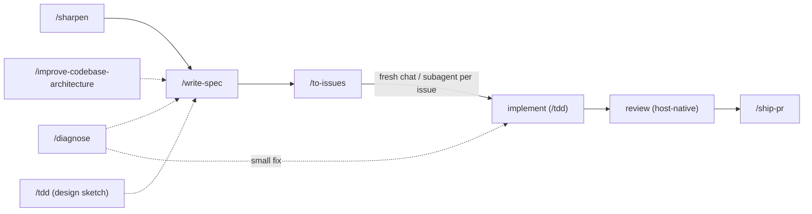
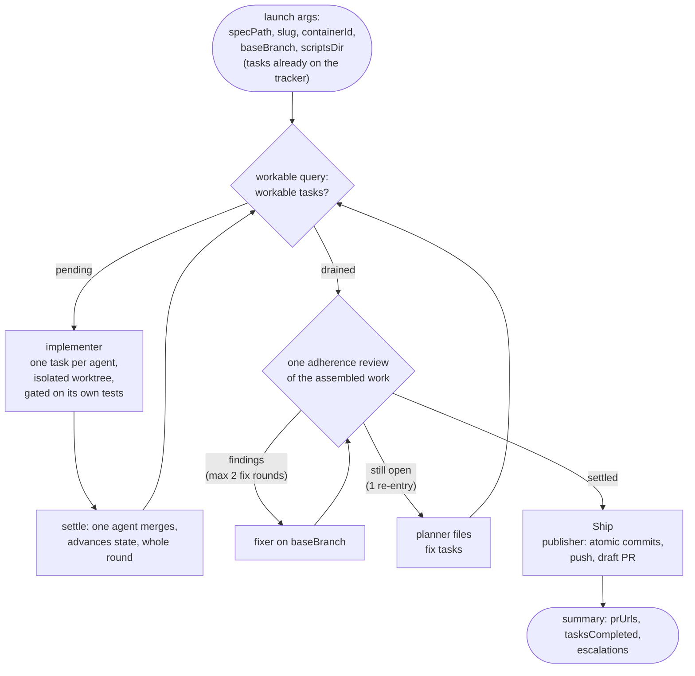

# swe plugin

The core of agent-toolbox: a spec-driven software-engineering workflow packaged
as skills, capability agents, a deterministic workflow conductor, and a
formatting hook. The premise is that agents ship reliable work when the
process is explicit — designs get stress-tested before they become specs,
specs are proven by committed tests, status lives on the issue tracker, and
publication is atomic commits behind a draft PR.

## Contents

```text
plugins/swe/
├── skills/            # 14 workflow skills (SKILL.md each — the canonical contracts)
├── agents/            # 10 agent definitions: Claude .md + Codex .toml twins (the delegators: .md only)
├── workflows/
│   └── swe-loop.js    # deterministic conductor for the post-approval phases
├── .mcp.json          # external providers, exposed to Claude Code as tools
├── mcp/
│   └── acp_bridge.py  # Agent Client Protocol agent -> MCP, with the permission policy
├── scripts/
│   ├── linear_tracker.py      # Linear via the `linear` CLI: workable set, container link, status sync
│   └── validate_artifacts.py  # shape checks for specs and issues before publish
└── hooks/
    ├── hooks.json                       # event wiring for the two hooks below
    ├── symlink-worktree-shared-dirs.sh  # link gitignored local dirs into worktrees
    └── format-python.sh                 # format + lint .py files after Write/Edit
```

## The workflow spine

Every path through the plugin converges on the same spine:
**sharpen → spec → issues → implement → review → PR.**

Work can enter anywhere — `/sharpen` for an unsettled design, `/diagnose` for
a known bug, `/improve-codebase-architecture` when hunting refactors — and
converges on `/write-spec`. From there `/to-issues` makes the tracker the task
and status ledger, implementation proves behavior per `/tdd`, a host-native
review pass (e.g. `/code-review`) runs before `/ship-pr` publishes.



Two ways to run the spine:

- **Skill by skill** — invoke each skill yourself. Useful for work that is
  already mid-flight or does not need the full loop.
- **As one resumable command** — `/start-loop <idea>` owns the interactive
  half (triage, design, approval gate, splitting), then launches the swe-loop
  conductor, which runs every remaining phase without prompting.

## The swe-loop

`/start-loop` first triages the idea against four criteria (unambiguous
against the repo and ADRs, ≤ 6 estimated tasks, no destructive surface, no
new external dependencies). All four pass → the design phase runs
autonomously and the spec is marked approved without a prompt. Any fail →
the gated path: `/sharpen` interactively, `/write-spec`, and one explicit
spec approval — the only prompt. Either way the approved spec authorizes the conductor;
after that, problems reach the user as data (escalation comments and the run
summary), never as live prompts.

The conductor is `workflows/swe-loop.js` — a deterministic script, not an
agent. It decides what runs when; agents do exactly one phase each and return
structured data (identifiers in, typed status out, never prose).



The code is reviewed **once**, assembled, rather than per task and then again
through a lens panel: a task's own gate is the lint/types/tests its
implementer already runs, which cost no tokens. In the run that motivated this
shape, reviewing the same lines three times was 52% of the token spend, and
merging and marking each task through its own agent was another 15% of it
spent on deterministic git and one API call per task.

The loop's cost ceilings are explicit constants, guarded by a static test:
the assembled review gets at most **2** fix rounds, surviving findings
re-enter the implement loop at most **once**, and the implement loop
itself caps at **25** rounds — anything that will not settle inside those
bounds becomes a loud escalation instead of a longer run. Unresolved findings
remain structured in the run summary's escalations.

Tasks run concurrently: implementers work in isolated git worktrees and
merges into the integration branch are serialized, so parallel tasks never
race on the working copy.

### Handoffs and escalation

Every agent boundary carries only identifiers and artifact pointers — spec
path, slug, container id, branch — never conversation state. State a resumed
run reads is machine-readable and never a markdown comment: approval, execution
mode, run id, integration branch and tracker container live in the spec's YAML
frontmatter; issue status lives on the tracker; what is already merged lives in
git. Comments carry only what humans read — triage rationale, progress notes,
escalations.

### Cross-provider role routing

Claude is always the orchestrator. Two worker roles run elsewhere by default:

| Role          | Default provider | Model                        |
| ------------- | ---------------- | ---------------------------- |
| `implementer` | OpenCode Go      | `opencode-go/gpt-5.6-luna`   |
| `reviewer`    | OpenCode Go      | `opencode-go/deepseek-v4-pro`|
| `planner`     | Claude           | `swe:planner`                |
| `publisher`   | Claude           | `swe:publisher`              |

Implementation and review dominate a run's token cost and are bounded enough to
hand over whole. Planning and publishing are low-token and high-side-effect, so
outsourcing them buys nothing — and every deterministic step (the workable
query, the settle agent, tracker bookkeeping, the run summary) is never routed
at all, on a pinned model so a run behaves the same whatever the host session
is running.

The launch args accept an optional `roles` map that overrides any of it. Keys
are the four roles; values are `claude`, `codex` or `opencode`.

```jsonc
{ "roles": { "implementer": "claude", "reviewer": "codex" } }
```

An explicit entry always beats the default, so routing a role back to `claude`
is how you opt out. `opencode` is valid for `implementer` and `reviewer` only —
the two roles it has a model-pinned forwarder for — and routing another role
there is rejected at launch rather than mid-run.

A routed role needs that provider's CLI installed and authenticated. An
unavailable provider, an unauthenticated subscription, an unavailable model or
a failed ACP startup surfaces as a delegation failure and then an escalation.
Nothing ever falls back to another provider on its own: a silent fallback would
quietly spend Claude or Codex budget on work that was routed elsewhere
precisely to avoid that.

## Skills

Each `SKILL.md` is the canonical contract; summaries here are orientation.

**Design and specification**

| Skill        | What it does                                                                                                                                              |
| ------------ | --------------------------------------------------------------------------------------------------------------------------------------------------------- |
| `sharpen`    | Interviews the user until every branch of a design's decision tree is resolved; cross-checks claims against the code; records durable decisions as ADRs   |
| `write-spec` | Produces the feature spec — a pure-markdown `NNNN-<slug>.md` in `docs/agents/specs/` whose behaviors are proven by committed tests; carries the approval field |
| `codebase-design` | Shared vocabulary for deep modules — depth, seams, adapters, the deletion test; loaded by other skills when designing interfaces                      |
| `improve-codebase-architecture` | Hunts deepening refactors: shallow modules that should absorb their callers' complexity                                                     |

**Execution**

| Skill        | What it does                                                                                                                       |
| ------------ | ---------------------------------------------------------------------------------------------------------------------------------- |
| `start-loop` | Runs or resumes the swe-loop: container, triage, design, approval gate, then launches the conductor                                 |
| `to-issues`  | Publishes a spec as vertical-task tracker issues with native blocked-by relations; the tracker becomes the status ledger           |
| `implement`  | Orchestrates implementation — and is the manual fallback conductor on hosts without the Workflow tool                               |
| `tdd`        | Functional-test discipline: sketch intended behavior as `tests/temp/` scratch scripts, refactor survivors into committed tests      |
| `ship-pr`    | Atomic commits, push, draft PR kept current; `finalize` re-verifies and flips it ready for review                                   |

**Support**

| Skill             | What it does                                                                                    |
| ----------------- | ----------------------------------------------------------------------------------------------- |
| `diagnose`        | Disciplined debugging: feedback loop, reproduce, hypothesize, instrument, fix, regression-test  |
| `merge-conflicts` | Resolves merge/rebase conflicts by tracing each side's intent; verifies with the project checks |
| `research`        | Investigates a question against primary sources; captures cited findings as markdown            |
| `qmd`             | Searches local markdown knowledge bases with the `qmd` CLI                                      |
| `setup-repo`      | Interview-driven repo setup: thin `AGENTS.md`, `CLAUDE.md` symlink, `docs/agents/` topology     |

## Agents

Ten definitions in `agents/`: each a Claude `.md`, six with a Codex `.toml`
twin kept in sync (the model matrix below is pinned by `tests/test_skill_drift.py`).
They are the loop's workers; the conductor or the orchestrating session
decides what runs when.

| Agent             | Purpose                                                                                  | Claude model (effort) | Codex model (effort)   |
| ----------------- | ---------------------------------------------------------------------------------------- | --------------------- | ---------------------- |
| `explorer`        | Cheap read-only evidence gathering with cited paths                                      | haiku                 | gpt-5.6-luna (medium)  |
| `architect`       | Read-only design resolution and spec drafting; returns drafts for the caller to apply    | fable (high)          | gpt-5.6-sol (high)     |
| `planner`         | Publishes an approved spec as vertical tracker tasks with blocked-by relations          | sonnet (medium)       | gpt-5.6-terra (medium) |
| `implementer`     | Executes one bounded code, test, documentation, or tracker task under caller constraints | sonnet (medium)         | gpt-5.6-sol (medium)   |
| `reviewer`        | Read-only review of a diff or implementation against caller-provided criteria or a lens  | sonnet (high)         | gpt-5.6-terra (high)   |
| `publisher`       | Owns git and GitHub publication: atomic commits, push, PR creation                       | sonnet (medium)       | gpt-5.6-terra (medium) |
| `codex-delegator` | Thin forwarder that runs one bounded task on the local Codex CLI, verbatim               | sonnet (low)          | — (Claude-side only)   |
| `opencode-explorer` | Thin forwarder: read-only repository exploration on OpenCode Go                        | sonnet (low)          | — (Claude-side only)   |
| `opencode-implementer` | Thin forwarder: one bounded write assignment on OpenCode Go                         | sonnet (low)          | — (Claude-side only)   |
| `opencode-reviewer` | Thin forwarder: read-only review on OpenCode Go                                        | sonnet (low)          | — (Claude-side only)   |

The delegators have no `.toml` twin: on the Codex harness the host *is* a
provider, so there is nothing to delegate to.

## Delegating to another provider

The delegators do not shell out. Each external provider is registered in
`.mcp.json` as an MCP server, so a delegation is a typed tool call — the model
fills a JSON schema instead of composing a command line, and quoting, sandbox
flags, exit codes and timeout ceilings stop being the model's problem.

| Provider | Surface                                    | Tools                                    |
| -------- | ------------------------------------------ | ---------------------------------------- |
| Codex    | `codex mcp-server` (native MCP over stdio) | `mcp__plugin_swe_codex__codex`, `…__codex-reply`    |
| OpenCode | `opencode acp` through `mcp/acp_bridge.py`, one server per role | `mcp__plugin_swe_opencode-{explorer,implementer,reviewer}__delegate` |

Each forwarder agent's `tools` field lists only its own provider's tools, so
"never work the task yourself" is a property of the agent rather than a rule in
its prompt: it holds no `Read`, no `Grep`, no `Bash`. An agent that inherited
every tool could quietly answer from its own exploration and never call the
provider at all.

### OpenCode Go

Requires the `opencode` CLI on PATH and an authenticated OpenCode Go
subscription — check both with `opencode providers list`, which must list
`OpenCode Go`. Nothing else is configured: the plugin registers three ACP-bridged
MCP servers, one per role, each pinning its model in `.mcp.json`.

| Forwarder              | Model                          | Reasoning | Mode      |
| ---------------------- | ------------------------------ | --------- | --------- |
| `opencode-explorer`    | `opencode-go/deepseek-v4-flash`| high      | read-only |
| `opencode-implementer` | `opencode-go/gpt-5.6-luna`     | high      | write     |
| `opencode-reviewer`    | `opencode-go/deepseek-v4-pro`  | max       | read-only |

Three roles, three models, on purpose:

- **Exploration** is high-volume read-only repository archaeology. V4 Flash is
  the cheapest model on the plan with a 1M-token context, which is the shape
  that work has.
- **Implementation** is where a model error costs the most, so it gets Luna,
  the stronger agentic coding model.
- **Review** must not share the implementer's model, or it re-reads its own
  reasoning. V4 Pro is strong, inexpensive, long-context, and different.

`.mcp.json` is the only operative source for those ids: the forwarder agents
receive a `delegate` tool with no `model` field at all, so a model is something
the plugin configures rather than something a subagent is asked to remember.
Changing one is a one-line edit, and `tests/test_skill_drift.py` fails if any
prose disagrees with it.

The explorer is deliberately not a swe-loop role — the conductor has no
exploration phase to spend it on. It is there for any skill or orchestrator
that wants cheap repository evidence: dispatch the `swe:opencode-explorer`
subagent with a bounded question and a workspace root.

### The ACP bridge

[Agent Client Protocol](https://agentclientprotocol.com) is the JSON-RPC
protocol OpenCode, Copilot, Gemini CLI and the Zed agents speak;
`mcp/acp_bridge.py` translates one onto MCP. Adding another ACP agent is one
`.mcp.json` entry — the bridge takes the agent's command as its argv, after its
own optional `--model`, `--effort` and `--read-only-mode` flags.

The bridge is also where `mode: read-only` becomes true. Codex has an OS-level
sandbox (`sandbox: read-only`); an ACP agent has none, and instead asks the
client for permission per tool call. The bridge answers those requests itself:

- `read-only` allows only non-mutating tool kinds (`read`, `search`, `fetch`,
  `think`) and rejects everything else, including kinds ACP may add later
- `write` allows a mutating call when every path it names resolves inside the
  workspace — symlinks resolved first, so a link out of the worktree is a write
  out of the worktree
- one-shot options are always preferred, so the bridge never installs a standing
  grant covering calls its policy never saw

A tool call naming no location — a shell command — is allowed in `write` mode:
ACP does not describe its effects, and Codex's sandbox is the stronger
guarantee when a task needs one.

Answering permission requests is not always enough. OpenCode auto-approves
edits *inside* the session cwd and never asks, so the kind policy above never
sees them; writes that escape the cwd do arrive as permission requests, so the
containment rule still holds. `--read-only-mode plan` closes the gap by putting
OpenCode in its own read-only session mode for a read-only delegation, and
restoring the session's opening mode for a write one. A bridge configured with
that flag against an agent advertising no such mode refuses the delegation
rather than running it unprotected.

Streamed ACP events become MCP progress notifications, which both surface live
progress and keep a long delegation clear of the 30-minute stdio idle timeout;
`.mcp.json` sets a one-hour wall-clock ceiling per call. Claude Code moves any
tool call past ~2 minutes into a background task on its own, so a long
delegation never blocks the session.

## Scripts

Skills and the conductor run these in place with `uv run`; nothing installs
into the target repo.

- **`linear_tracker.py`** — every deterministic Linear operation, through the
  `linear` CLI (no hand-written GraphQL or auth). `workable` prints a
  container's pickup-ready issues as JSON — not closed, nothing still
  blocking, not `ready-for-human` — where "already done in this run" is read
  from git (`git branch --merged`), not from tracker state, which does not
  advance until the run's PR lands. `container` resolves the Linear project a
  spec publishes into from the spec's own frontmatter, with distinct exit
  codes for "no container yet" and "the recorded one is gone" so a run can
  never create a duplicate project. `sync` promotes a container still reading
  backlog while its issues are underway. Fails loudly so a broken query is
  never mistaken for finished work.
- **`validate_artifacts.py`** — validates specs and issues before publish:
  frontmatter shape, status transitions, approval and tracker-container keys,
  acceptance criteria. Run by the conductor's agents and by `/start-loop`
  before launch.

## Hooks

`hooks/hooks.json` registers two hooks:

- **`symlink-worktree-shared-dirs.sh`** — on SessionStart, SubagentStart, and
  PostToolUse:EnterWorktree, links the main checkout's gitignored `artifacts`,
  `data`, and `docs/agents` into the current git worktree, so agents there use
  relative paths instead of climbing back out to the main checkout. Refuses to
  link anything git would track.
- **`format-python.sh`** — after any Write/Edit that touches a `.py` file,
  formats and lints it. It no-ops silently unless the file lives in a uv/ruff
  project, so it stays inert for repos that have not opted into that toolchain.
