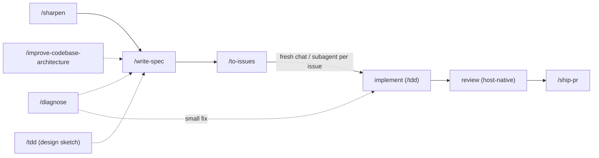
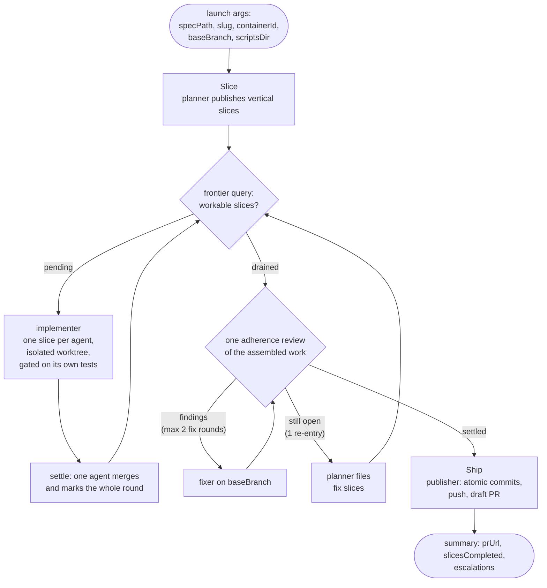

# swe plugin

The core of agent-toolbox: a spec-driven software-engineering workflow packaged
as skills, capability agents, a deterministic workflow conductor, and a
formatting hook. The premise is that agents ship reliable work when the
process is explicit — designs get stress-tested before they become specs,
specs are proven by committed tests, status lives on the issue tracker, and
publication is atomic commits behind a draft PR.

## Contents

```text
plugins/swe/
├── skills/            # 14 workflow skills (SKILL.md each — the canonical contracts)
├── agents/            # 7 agent definitions: Claude .md + Codex .toml twins (codex-delegator: .md only)
├── workflows/
│   └── swe-loop.js    # deterministic conductor for the post-approval phases
├── scripts/
│   ├── frontier.py            # tracker query: which slices are workable right now
│   ├── validate_artifacts.py  # shape checks for specs and issues before publish
│   └── format-python.sh       # PostToolUse hook target
└── hooks/hooks.json   # wires format-python.sh to Write/Edit on *.py
```

## The workflow spine

Every path through the plugin converges on the same spine:
**sharpen → spec → issues → implement → review → PR.**

Work can enter anywhere — `/sharpen` for an unsettled design, `/diagnose` for
a known bug, `/improve-codebase-architecture` when hunting refactors — and
converges on `/write-spec`. From there `/to-issues` makes the tracker the task
and status ledger, implementation proves behavior per `/tdd`, a host-native
review pass (e.g. `/code-review`) runs before `/ship-pr` publishes.



Two ways to run the spine:

- **Skill by skill** — invoke each skill yourself. Useful for work that is
  already mid-flight or does not need the full loop.
- **As one resumable command** — `/start-loop <idea>` owns the interactive
  half (triage, design, approval gate), then launches the swe-loop conductor,
  which runs every remaining phase without prompting.

## The swe-loop

`/start-loop` first triages the idea against four criteria (unambiguous
against the repo and ADRs, ≤ 6 estimated slices, no destructive surface, no
new external dependencies). All four pass → the design phase runs
autonomously and the approval marker is stamped without a prompt. Any fail →
the gated path: `/sharpen` interactively, `/write-spec`, and one explicit
spec approval — the only prompt. Either way the approved spec authorizes the conductor;
after that, problems reach the user as data (escalation comments and the run
summary), never as live prompts.

The conductor is `workflows/swe-loop.js` — a deterministic script, not an
agent. It decides what runs when; agents do exactly one phase each and return
structured data (identifiers in, typed status out, never prose).



The code is reviewed **once**, assembled, rather than per slice and then again
through a lens panel: a slice's own gate is the lint/types/tests its
implementer already runs, which cost no tokens. In the run that motivated this
shape, reviewing the same lines three times was 52% of the token spend, and
merging and marking each slice through its own agent was another 15% of it
spent on deterministic git and one API call per slice.

The loop's cost ceilings are explicit constants, guarded by a static test:
the assembled review gets at most **2** fix rounds, surviving findings
re-enter the frontier loop at most **once**, and the frontier loop
itself caps at **25** rounds — anything that will not settle inside those
bounds becomes a loud escalation instead of a longer run. Remaining
bloat-lens findings become the cut list; every other unresolved finding
becomes an escalation in the summary.

Slices run concurrently: implementers work in isolated git worktrees and
merges into the integration branch are serialized, so parallel slices never
race on the working copy.

### Handoffs and escalation

Every agent boundary carries only identifiers and artifact pointers — spec
path, slug, container id, branch — never conversation state. The tracker is
the durable memory: triage verdicts, gate records, run ids, per-slice
completion markers, and escalations all land as issue/container comments, so
a fresh session can resume any run from the tracker alone.

### Codex role routing

The launch args accept an optional `roles` map that points any worker role
(`planner`, `implementer`, `reviewer`, `publisher`) at the local Codex CLI —
those agents then run through the `codex-delegator` forwarder while Claude
stays the orchestrator. Unlisted roles stay on Claude.

## Skills

Each `SKILL.md` is the canonical contract; summaries here are orientation.

**Design and specification**

| Skill        | What it does                                                                                                                                              |
| ------------ | --------------------------------------------------------------------------------------------------------------------------------------------------------- |
| `sharpen`    | Interviews the user until every branch of a design's decision tree is resolved; cross-checks claims against the code; records durable decisions as ADRs   |
| `write-spec` | Produces the feature spec — a pure-markdown `NNNN-<slug>.md` in `docs/agents/specs/` whose behaviors are proven by committed tests; carries the approval marker |
| `codebase-design` | Shared vocabulary for deep modules — depth, seams, adapters, the deletion test; loaded by other skills when designing interfaces                      |
| `improve-codebase-architecture` | Hunts deepening refactors: shallow modules that should absorb their callers' complexity                                                     |

**Execution**

| Skill        | What it does                                                                                                                       |
| ------------ | ---------------------------------------------------------------------------------------------------------------------------------- |
| `start-loop` | Runs or resumes the swe-loop: container, triage, design, approval gate, then launches the conductor                                 |
| `to-issues`  | Publishes a spec as vertical-slice tracker issues with native blocked-by relations; the tracker becomes the status ledger           |
| `implement`  | Orchestrates implementation — and is the manual fallback conductor on hosts without the Workflow tool                               |
| `tdd`        | Functional-test discipline: sketch intended behavior as `tests/temp/` scratch scripts, refactor survivors into committed tests      |
| `ship-pr`    | Atomic commits, push, draft PR kept current; `finalize` re-verifies and flips it ready for review                                   |

**Support**

| Skill             | What it does                                                                                    |
| ----------------- | ----------------------------------------------------------------------------------------------- |
| `diagnose`        | Disciplined debugging: feedback loop, reproduce, hypothesize, instrument, fix, regression-test  |
| `merge-conflicts` | Resolves merge/rebase conflicts by tracing each side's intent; verifies with the project checks |
| `research`        | Investigates a question against primary sources; captures cited findings as markdown            |
| `qmd`             | Searches local markdown knowledge bases with the `qmd` CLI                                      |
| `setup-repo`      | Interview-driven repo setup: thin `AGENTS.md`, `CLAUDE.md` symlink, `docs/agents/` topology     |

## Agents

Seven definitions in `agents/`: each a Claude `.md`, six with a Codex `.toml`
twin kept in sync (the model matrix below is pinned by `tests/test_skill_drift.py`).
They are the loop's workers; the conductor or the orchestrating session
decides what runs when.

| Agent             | Purpose                                                                                  | Claude model (effort) | Codex model (effort)   |
| ----------------- | ---------------------------------------------------------------------------------------- | --------------------- | ---------------------- |
| `explorer`        | Cheap read-only evidence gathering with cited paths                                      | haiku                 | gpt-5.6-luna (medium)  |
| `architect`       | Read-only design resolution and spec drafting; returns drafts for the caller to apply    | fable (high)          | gpt-5.6-sol (high)     |
| `planner`         | Publishes an approved spec as vertical tracker slices with blocked-by relations          | sonnet (medium)       | gpt-5.6-terra (medium) |
| `implementer`     | Executes one bounded code, test, documentation, or tracker task under caller constraints | opus (medium)         | gpt-5.6-sol (medium)   |
| `reviewer`        | Read-only review of a diff or implementation against caller-provided criteria or a lens  | sonnet (high)         | gpt-5.6-terra (high)   |
| `publisher`       | Owns git and GitHub publication: atomic commits, push, PR creation                       | sonnet (medium)       | gpt-5.6-terra (medium) |
| `codex-delegator` | Thin forwarder that runs one bounded task on the local Codex CLI, verbatim               | sonnet (low)          | — (Claude-side only)   |

`codex-delegator` has no `.toml` twin: on the Codex harness the host *is*
Codex, so there is nothing to delegate to.

## Scripts

Skills and the conductor run these in place with `uv run`; nothing installs
into the target repo.

- **`frontier.py`** — prints the workable tracker issues in a spec's
  container as JSON: not completed/canceled, nothing open blocking, not
  labeled `ready-for-human`. Fails loudly on auth/HTTP/GraphQL errors so a
  broken query is never mistaken for a drained frontier.
- **`validate_artifacts.py`** — validates specs and issues before publish:
  frontmatter shape, status transitions, approval markers, acceptance
  criteria. Run by the conductor's graph nodes and by `/start-loop` before
  launch.

## Hooks

`hooks/hooks.json` registers one PostToolUse hook: after any Write/Edit that
touches a `.py` file, `scripts/format-python.sh` formats and lints it. It
no-ops silently unless the file lives in a uv/ruff project, so it stays inert
for repos that have not opted into that toolchain.
