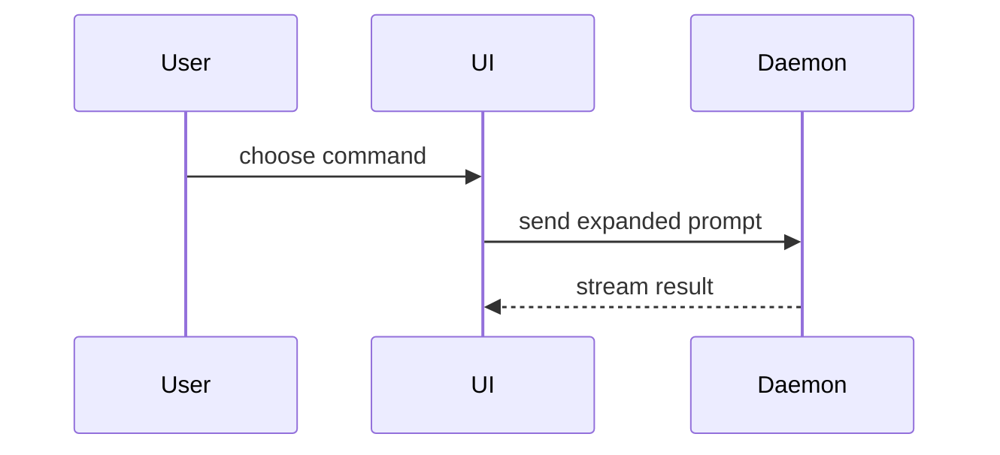

# Pull-request body template

Use this shape for the body. Omit the reviewer's guide when the diff is small
enough to read in order. End with the issue line from the workflow when one
applies.

````markdown
## Summary

<one or two sentences of what and why>

<diagram, diff sketch, or tree>

## Reviewer's guide

<most important diff first, reading order, mechanical sections>

## Evidence

- **Before:** <screenshot, output, or failing test>
  **After:** <screenshot, output, or passing test>

## Merge danger

**Door:** <one-way or two-way>

<optional: why>

**Blast radius:** <one-word description>

<optional: what a merge could affect>
````

## Summary

Pick the smallest view that makes the key point clear. Place each visual next
to the short text it supports. Keep only the calls, files, props, states, and
boundaries a reviewer needs. Usually one visual is enough; several is fine when
each makes a different point.

Show logic or an algorithm as pseudocode:

```text
on(save)
  if content is unchanged
    return cached result
  write new content
  return fresh result
```

Show runtime control flow as a call tree:

```text
submitForm
  createSession
    persistPrompt
    launchAgent
  navigateToSession
```

Show UI structure as a component tree, with the state and module boundaries
that matter:

```text
<SessionPage> (apps/example/src/routes/session.tsx)
  useSessionEvents()
  <SessionToolbar>
    <RunSkillButton> (packages/ui)
```

Show file responsibility or a broad refactor as a shallow file tree:

```text
src/
├── commands/       # parses user actions
├── sessions/       # owns session state
└── transport/      # sends API requests
```

Show component interaction or data flow with Mermaid:



Use a `diff` block when the point is what changes and the surrounding shape
already exists. Match the diff to the shape of the topic, such as a call tree:

```diff
 submitForm
   createSession
     persistPrompt
+    expandSkillMention
     launchAgent
   navigateToSession
+    subscribeToEvents
```

Show the whole block instead when most of it is new, when omitted context
would hide ownership or order, or when the reviewer needs a copyable target
shape.

## Evidence

Show concrete proof that each claimed behavior works, as a before and after.
Prefer a screenshot when the change is visual and the environment can capture
one. Otherwise show execution: the command a reviewer can paste with its
observed output, or the named test that failed before and passes after, with
its assertion sketched as pseudocode. When no reproducible demonstration
exists, say so and name what the reviewer should inspect instead.

## Merge danger

A two-way door is cheap to roll back, so it carries less risk. A change that
destroys data, migrates state, publishes something, or fixes a hard-to-reverse
decision is a one-way door. Say which one the PR is.

The blast radius is the scope of what the merge can affect. Consider every
consumer: callers and downstream packages, installed plugins and hooks, layout
and mobile rendering, stored data, and other agents or providers.

## Credits

Adapted from Matt Pocock's
[`pr` skill](https://github.com/mattpocock/skills/tree/main/skills/engineering/pr).
Its menu of Summary visuals comes from Dex Horthy's
[`show-me` skill](https://github.com/humanlayer/skills/blob/main/plugins/show-me/skills/show-me/SKILL.md).
